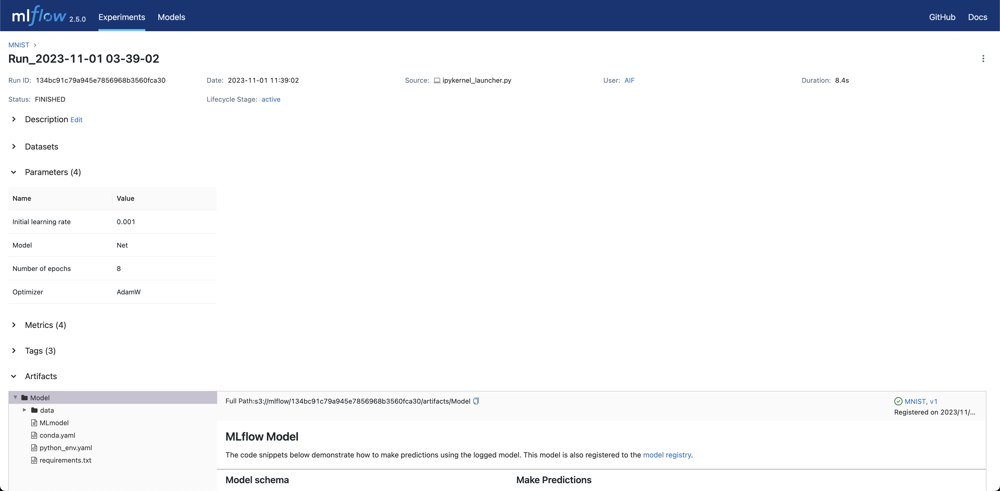
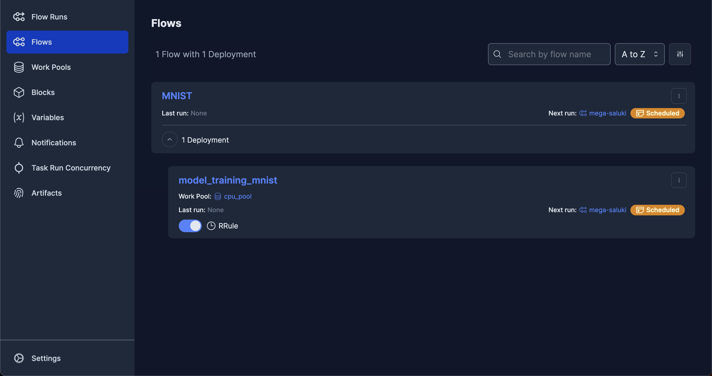
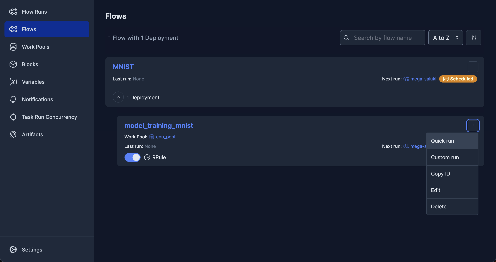
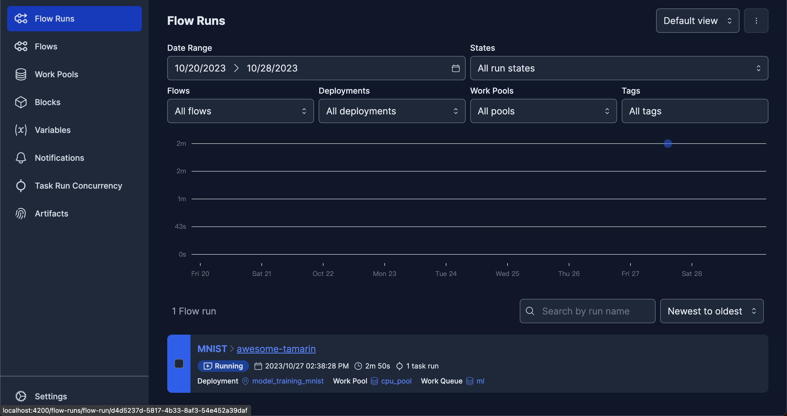
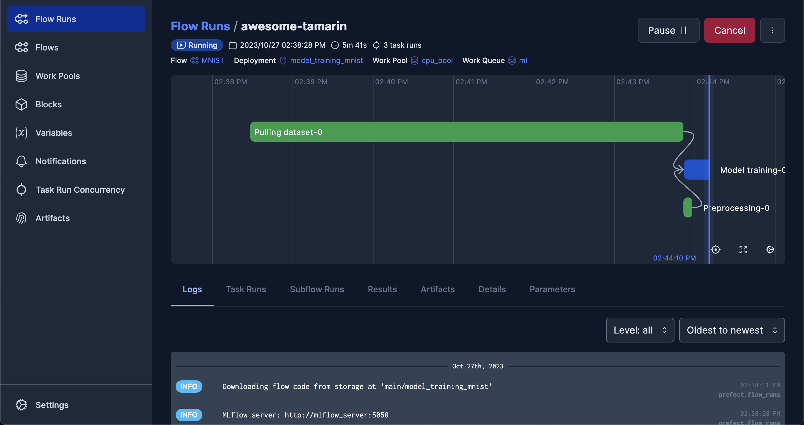

# 案例A––以手寫數字資料集實作系統建置與執行實驗
## 1 範例介紹
### 1.1 簡介
這份範例的目的是將MLOps的概念進行實現，包含模型訓練的實驗紀錄、版本控制以及部署。
我們將實際操作以下內容來模擬真實的開發過程中可能遇到的狀況：
1. 於本機端建立MinIO、Prefect、MLflow服務，使用各服務的UI監控模型的訓練、部署等階段
2. 使用MLflow追蹤模型訓練結果
3. 將模型上線進行預測，搜集使用者上傳的資料，投入原先資料集進行再訓練
4. 透過Prefect對模型再訓練進行自動化的排程


### 1.2 使用到的工具
在這份範例中我們將用到以下3個開源軟體來進行實作：

* [MinIO](https://min.io)
  
  MinIO是一種[物件儲存](https://aws.amazon.com/tw/what-is/object-storage/)服務，API設計成與[Amazon S3](https://aws.amazon.com/tw/s3/)相同，可以用來模擬S3的服務。物件儲存有別於檔案儲存，每一個物件在檔案系統中都有獨立的識別碼，因此要調用檔案時無需手動一層一層去搜尋，非常適合用在機器學習任務上或是MLOps中，因為我們直接將模型以及資料物件儲存在系統中，要取出模型進行推論時也相當方便。

* [Prefect](https://www.prefect.io)

    Prefect的主要功能是製作排程，並且能透過一個Agent去執行排程的任務。只要將模型前處理、訓練等等的工作流程整合到一個Python檔案，就能將工作流程上傳遠端伺服器進行排程，並選擇要讓程式在哪一台裝置執行，團隊成員也能隨時透過UI監控每個工作的狀態。

  Prefect有以下這兩項功能：
  * [`task`](https://docs.prefect.io/latest/concepts/tasks/)：用來裝飾`main`會執行到的函式，Prefect將這些`task`裝飾的函式視為工作流程中的步驟，並以視覺化方式顯示這些步驟的執行資訊，使用者也能在`task`裝飾器自訂這些任務的名稱、重新嘗試次數、重新嘗試的等待時間等等。
  * [`flow`](https://docs.prefect.io/latest/concepts/flows/)：用來裝飾`main`函式，可以把`main`函數想成是一套工作流程，裡面包含許多不同函式組成的步驟，而那些步驟都會以`task`裝飾。使用者能在`flow`裝飾器設定重新嘗試的次數、等待時間，以及最長的執行時間限制等等，以達到更有彈性的排程管理。例如：
  ````python
  import mlflow
  from prefect import flow, task

  @task(name='Model training')  # 以@task裝飾，代表是其中的任務
  def model_training():
      ...

  @flow(name='MNIST')  # 以@flow裝飾，代表是一個工作流程
  def main():
      model_training()
      ...

  if __name__ == '__main__':
      main()
  ````
  首先我們可以看到其中的`main`與`model_training`函式分別以`@flow`與`@task`裝飾，代表兩者分別是工作流程以及流程中的任務。
  一般來說模型訓練會包含資料前處理、模型訓練以及指標評估等等步驟，為了記載這些步驟分別花費的時間，以及考量到有些步驟可能會失敗，必須設計重新嘗試機制，這些步驟會被寫成不同的函式。
  
  詳細使用方式可以參考Prefect的[教學](https://docs.prefect.io/latest/tutorial/)。

* [MLflow](https://mlflow.org)

    MLflow能追蹤模型，紀錄實驗結果，也提供簡單易懂的視覺化工具。除了實驗紀錄，MLflow能將模型進行版本控制，以及透過API的方式載入模型物件，並能用來推論，這些功能可以透過指令列以及圖形化介面達成。

### 1.3 資料夾內容說明 
這份範例包含以下資料夾：
* [`flow_schedualer/`](./flow_scheduler/)：任務相關檔案，主要包含模型訓練的.py檔、訓練資料等。訓練資料為[`flow_scheduler/flows_mnist/data/MNIST.zip`](./flow_scheduler/flows_mnist/data/MNIST.zip)，下載後須先解壓縮。
* [`flow_agent/`](./flow_agent/)：從本機端部署任務到伺服器上所需的檔案。
* [`server/`](./server/)：在伺服端將服務架設起來所需的檔案。
* [`ml_experimenter/`](./ml_experimenter/)：以Jupyter容器模擬工程師進行模型開發的環境，可以在Jupyter Lab中進行不同資料集的模型訓練，並使用MLflow來進行實驗追蹤與模型版本控制，以及透過MLflow API，以訓練好的模型對資料進行預測。

資料夾中通常包含以下幾種類型的檔案：
* `docker-compose.yml`

  由[docker compose](https://docs.docker.com/compose/)透過[`docker-compose.yml`](https://docs.docker.com/compose/compose-file/03-compose-file/)來建立各自的容器。檔案中包含部分需修改的項目，請參考註解。

  `docker-compose.yml`裡面較常見的設定及其意義為：
  * `restart`：選擇滿足何種條件時容器將重新啟動。
  * `image`：用來建立容器的映像檔。
  * `ports`：格式為`主機的Port:容器的連接埠（Port）`，例如`5050:5002`代表將主機的5050連接埠綁定容器的5002連接埠。
  * `environment`：容器內的環境變數。
  * `volumes`：容器要掛載的目錄，格式為`主機上的路徑:容器內的路徑`，例如`data:/data`代表將主機目前目錄下的`data`掛載到容器內的`/data`。
  * `entrypoint`：容器啟動後首先要被執行的指令。

* 環境變數 `.env`

  環境變數全部存在`.env`檔案中，內容是各項服務所需要的環境變數。考量到裡面有較為機敏的資料如使用者帳號密碼，統一整理在`.env`檔裡面的好處是比較便於管理，此外也可以透過Python的[dotenv](https://pypi.org/project/python-dotenv/)來載入環境變數。

**注意事項：**
這份範例中所有的`docker-compose.yml`都需搭配相對應的環境變數`.env`，如果沒有放置正確的`.env`會導致服務無法正常執行。

## 2 建立各項服務的伺服器
### 2.1 建立容器
**注意事項：**
* 若有更改各服務的連接埠（Port），記得要將相對應的`.env`、`docker-compose.yml`以及UI連結跟著修改。舉例來說，如果我們將MLflow的連接埠從5050更換成5060，那就必須同時將`server/`底下的`.env`、`docker-compose.yml`裡面跟MLfow相關的環境變數都更改，除此之外，不要忘了`flow_sheduler`、`flow_agent`裡面MLflow相關的設定也都要同步更改。
* 以下步驟中，在首次建立容器時Docker可能會耗費較多時間下載映像檔，下載完成後通常僅需大約1分鐘即可建立容器，只有`ml_experimentor`因下載[Jupyter](https://jupyter.org)套件，會需要更多的下載時間。

Server資料夾主要負責將MinIO、Prefect、MLflow的伺服器建立起來，讓不同容器以及不同電腦都能存取。
例如以Prefect來說，程式碼以及執行結果會儲存在伺服器中，MLflow則是會將實驗結果儲存在伺服器中。
透過資料夾中的`docker-compose.yml`一次建立所有服務，步驟如下：
````commandline
cd server/
docker compose up --build
# 加上-d是為了讓docker建立容器時在背景執行，不顯示各個容器的輸出資訊，因此不會佔用一個終端機視窗
# 為了避免有容器建立過程發生問題而沒注意到，建議初次使用先不加上-d
````

### 2.2 測試容器是否正常建立
容器開啟完成後，可前往下列各服務的連結，確認UI是否正常運作。若UI未出現，建議到各容器去查看輸出紀錄是否有錯誤碼，以及確認伺服器端是否正常運作。

* MLflow UI: [`http://localhost:5050/`](http://localhost:5050/)
* Prefect UI: [`http://localhost:4200/`](http://localhost:4200/)
* Minio UI: [`http://localhost:9001/`](http://localhost:9001/)

如果以上服務都可正常進入UI，就能進入到實作的階段了。

## 3 實作
確認所需的服務都已建立完成並啟動之後，接著就要透過實作以下幾個主題：
* 3.1 對資料集進行版本控制
* 3.2 在模型開發階段中，進行實驗性的訓練
* 3.3 設定自動化排程，執行模型的定期再訓練

### 3.1 對資料集進行版本控制
在MLOps循環中，資料的版本控制也是重要環節，一般來說開發者除了會用不同的模型、超參數來訓練不同版本的模型，也會使用不同資料（例如在某個版本可能增加一些新標注好的資料）來進行訓練，然而資料版本間的「差異」通常難以用簡單的幾個數值來作為代表。舉例來說，對於結構化資料，資料的差異可能是新增或移除了某幾列；而對非結構化資料來說，可能是新增或移除了某些檔案，有鑑於此，我們需要類似git的版本控制工具，就像是管理程式碼一樣來管理資料。[Data Version Control (DVC)](https://dvc.org)是著名的開源資料版控工具，提供了命令列介面（Command-line interface）來進行操作，它的特色是操作邏輯與git非常類似，學習成本低，因此在範例中我們選擇DVC作為資料版本控制的工具。

#### 3.1.1 安裝DVC以及基本設定
# 製作第一版本的資料
首先我們在本機端建立第一個版本的資料集，依照以下指令即可完成建立。
````commandline
cd flow_scheduler/flows_mnist/data/
git init  # 要使用DVC來做資料版本控制，需要先以git對資料夾進行初始化
dvc init
dvc add MNIST  # MNIST為資料所在的資料夾名稱
git add .gitignore MNIST.dvc  # git add 後面的檔案順序不影響結果
# 執行dvc add MNIST後DVC也會在終端機上輸出這一條訊息，並且告訴使用者可以直接複製來執行
git commit -m "First version of training data."  # 以git對.dvc進行版控，製作第一個提交
git tag -a "v1.0" -m "Created MNIST."  # 建立標籤，未來要重回某個版本時比較方便
````

#### 3.1.2 將訓練資料推送至上游以及從上游下載
之後就能將完整的訓練資料推送至上游（DVC支援常見的儲存空間，如Google Storage與S3），對產生的`.dvc`檔進行版控。要注意的是，由於`dvc push`會將完整的訓練資料推送至上游的儲存空間，需留意空間使用量。在此範例執行`dvc push -r remote`通常需要5分鐘左右完成，實際時間會隨裝置效能有所差異；若是推送到網路上的遠端，則會因網路上傳頻寬而有所差異。由於要將版本控制相關檔案推送至遠端，因此必須先完成步驟2.1，建立好要讓DVC使用的物件儲存空間。

**注意事項：**
步驟3.1.2至3.1.3也可以透過執行「[`data_version.sh`](./flow_scheduler/flows_mnist/data/data_version.sh)」一次完成。

````commandline
dvc remote add remote s3://dvcmnist/  # dvc add 後面接的「remote」是自定義的上游名稱
dvc remote modify remote endpointurl http://localhost:9000
export AWS_ACCESS_KEY_ID=admin
export AWS_SECRET_ACCESS_KEY=adminsecretkey
dvc push -r remote  # 把這次的更動推送上到名為remote的遠端上

# ls MNIST/train/0 | wc -l  # 可以透過確認數字0的資料數量來確認版本

````
未來要下載上游的資料（例如在新的電腦或容器上），先下載`MNIST.dvc`，再執行以下程式碼：
````commandline
export AWS_ACCESS_KEY_ID=admin
export AWS_SECRET_ACCESS_KEY=adminsecretkey
dvc remote add remote s3://dvcmnist/
dvc remote modify remote endpointurl http://localhost:9000
dvc pull --remote remote
````

#### 3.1.3 模擬產生新版本的資料
首先我們將`train_v2`的資料拷貝到對應的類別，例如`train_v2/0/`底下的所有資料都拷貝到`train/0/`，依此類推直到10個類別都完成，我們透過這個過程來模擬增加資料後，作為第二個版本的狀況。

您可以透過執行「[`flow_scheduler/flows_mnist/data/expand_train_data.py`](./flow_scheduler/flows_mnist/data/expand_train_data.py)」來一次完成拷貝的步驟。

````commandline
dvc add MNIST
git add MNIST.dvc
git commit -m "Add some images"
git tag -a "v2.0" -m "v2.0, more images"
dvc push -r remote  # 把這次的更動Push上去
# git push  # 如果有遠端的git repo可以執行

# ls MNIST/train/0 | wc -l  # 可以透過確認數字0的資料數量來確認版本是否有不同，這個版本要比第一個版本多出一些
````

### 3.2 在模型開發階段中，進行實驗性的訓練
**注意事項：** 若您的裝置原先已在運行Jupyter Notebook，建議先確認原先的Jupyter Notebook所使用的連接埠與此步驟所使用的值是否相同。
若相同則須找到[`ml_experimenter/docker-compose.yaml`](./ml_experimenter/docker-compose.yml)中的以下內容，參考右側的註解進行修改，並且使用修改後的連接埠進入Jupyter Notebook環境：
````dockerfile
    ports:
      - 8888:8888  # <-- 將前面的8888改成其他可使用的連接埠，例如改成8890:8888
````

資料就緒後，緊接著就是模型開發。機器學習模型的開發過程中，開發者會多方嘗試不同模型和不同超參數。
以深度學習模型為例，需要調整的超參數有學習率、批次大小、迭代次數等等，這些都會對模型的性能、收斂速度，也對泛化能力產生深遠影響。因此，超參數的實驗結果必須被追蹤紀錄，除了手動記錄外，也可以利用工具協助。
在本階段我們使用Jupyter Notebook來進行實作，搭配MLflow來追蹤實驗結果，並以其提供的Python API將這些模型進行版本控制，詳見[`ml_experimenter/notebooks/user/mnist_example/mlflow-example.ipynb`](./ml_experimenter/notebooks/user/mnist_example/mlflow-example.ipynb)。
為了建立用來進行模型實驗的Jupyter Notebook環境，進到[`ml_experimenter`](./ml_experimenter/)並執行以下指令：

````commandline
docker compose up --build
````
接著進入[`http://localhost:8888`](http://localhost:8888)，即可進到Jupyter Notebook環境。

在執行了幾次模型訓練後，可以進入MLflow UI來檢視剛才紀錄的實驗結果，進入MLflow UI後，點選實驗名稱「MNIST」進入到這個實驗的頁面：


進入實驗後，點選執行的`Run Name`即可檢視該次執行的結果：


可以看到左側有包含「Description」、「Datasets」等等的資訊可以展開，假如我們想要檢視此次的超參數設定，可以點選「Parameters」，就會看到模型訓練時的超參數：


### 3.3 利用已部署上線的模型搜集資料，定期再訓練
#### 3.3.1 製作自動化排程，並上傳至Prefect伺服器
當模型已上線，就能陸續蒐集使用者上傳的資料來更新資料集，定期進行模型再訓練。這個章節我們將透過Prefect來將資料下載、模型訓練、結果追蹤等步驟進行自動化排程。

首先我們需要依實際情況設定[`flow_schedualer/flows_mnist/flow.yml`](./flow_scheduler/flows_mnist/flow.yaml)，YAML檔裡附有每一個項目的說明。

接著進到[`flow_schedualer/`](./flow_scheduler/)，執行以下指令，將排程資料上傳到Prefect伺服器：
````commandline
docker compose up --build
````
這個容器的目的，是將`Flows`資料夾的檔案上傳到Prefect的伺服器，容器執行完成後就會關閉不再重新啟動。執行時須留意，由於會將`flows/`資料夾中未被`.prefectignore`提及的任何檔案都會被上傳到伺服器，當檔案較多或包含大型檔案時，需要比較久的時間完成。
當容器成功建立，會看到包含以下文字的訊息：
````
flow_scheduler  | Created work pool 'cpu_pool'.
flow_scheduler  | Found flow 'MNIST'
flow_scheduler  | Deployment YAML created at '/root/flows/main-deployment.yaml'.
flow_scheduler  | Successfully uploaded 49 files to s3://prefect/main/model_training_mnist
flow_scheduler  | Deployment 'MNIST/model_training_mnist' successfully created with id 
flow_scheduler  | '79e3918f-5777-4f10-9657-2cef6edb4463'.  # <--在您的環境中，執行時顯示的id可能會與此範例不同
flow_scheduler  | 
flow_scheduler  | To execute flow runs from this deployment, start an agent that pulls work from 
flow_scheduler  | the 'cpu_pool' work pool:
flow_scheduler  | 
flow_scheduler  | $ prefect agent start -p 'cpu_pool'
flow_scheduler exited with code 0
````
看到這個訊息表示排程已上傳至Prefect伺服器，正在等待「代理者」Agent來執行這個排程，接下來就要啟動另一個容器來建立Agent。

#### 3.3.2 建立Agent來執行排程
排程建立之後，便等待著Agent來執行，我們可以把Agent想像成機器人，只要事先把排程告訴Agent，它就會依照排程指定的時間去Prefect伺服器下載`flows/`資料夾，並且執行我們指定的`py`檔（此範例為`flow.py`）。
在專案中我們可根據需求來決定Agent要在哪一個裝置啟動，例如當任務是深度學習模型訓練，自然就可能選擇配備GPU的電腦來執行；如果是資料下載或前處理，則可能選擇配有較強CPU的電腦，此範例以CPU版本進行說明，若您使用配有CUDA資源的裝置，可改為GPU版本。Agent同樣是以容器來啟動：
````commandline
cd flow_agent/flow_agent_pool_ml_cpu/  # 若要啟動GPU版本的Agent，則將'flow_agent_pool_ml_cpu'改為'flow_agent_pool_ml_gpu'
docker compose up --build
````

現在我們已經設定好排程，也建立好負責執行程式碼的Agent了，接著進入Prefect UI，在左側欄選擇「Flows」，確認是否出現「MNIST」


由於目前還沒到排程的指定時間，我們也可以強制執行一次。展開「MNIST」，到「model_training_mnist」卡片的右上角點選選項按鈕，點一下「Quick run」即可快速執行一次。


接著可以在左側欄位點選「Flow Runs」，點選剛才開始執行的任務（任務名稱為Prefect隨機生成）


就可以監控任務執行的狀態


* 補充：如果建立容器時在`docker compose up`加入`-d`，讓容器在背景執行，Docker便不會將輸出的資訊顯示在終端機，此時可以進到`flow_agent/`執行`docker compose logs`來查看容器執行時的輸出資訊。

**注意事項：**
須先完成3.4.1步驟建立排程，才可執行3.4.2步驟來執行。
