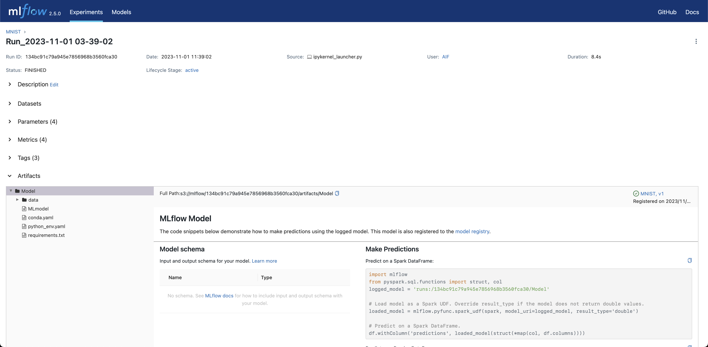

# 以手寫數字資料集實作系統建置與執行實驗
## 1 範例介紹
### 1.1 簡介
這份範例的目的是以[手寫數字資料集（MNIST database）](http://yann.lecun.com/exdb/mnist/)，實際操作以下幾個步驟：
1. 透過DVC進行資料版本控制
2. 使用MLflow追蹤模型訓練結果
3. 透過Prefect對模型再訓練進行自動化的排程

### 1.2 使用的工具
在這份範例中我們將用到以下3個開源軟體：
* [MinIO](https://min.io)：MinIO是一種[物件儲存](https://aws.amazon.com/tw/what-is/object-storage/)服務，物件儲存有別於檔案儲存，每一個物件在檔案系統中都有獨立的識別碼，適合用在機器學習任務上或是MLOps中。

* [Prefect](https://www.prefect.io)：Prefect的主要功能是製作排程，並且能透過一個Agent去執行排程的任務。只要將模型前處理、訓練等等的工作流程整合到一個Python檔案，就能將工作流程上傳遠端伺服器進行排程，並選擇要讓程式在哪一台裝置執行，團隊成員也能隨時透過其UI監控每個工作的狀態。

  範例中會用到以下這兩項常用功能：
  * [`task`](https://docs.prefect.io/latest/concepts/tasks/)：用來裝飾`main`會執行到的函式，Prefect將這些`task`裝飾的函式視為工作流程中的步驟，並以視覺化方式顯示這些步驟的執行資訊，使用者也能在`task`裝飾器自訂這些任務的名稱、重新嘗試次數、重新嘗試的等待時間等等。
  * [`flow`](https://docs.prefect.io/latest/concepts/flows/)：用來裝飾`main`函式，可以把`main`函數想成是一套工作流程，裡面包含許多不同函式組成的步驟，而那些步驟都會以`task`裝飾。使用者能在`flow`裝飾器設定重新嘗試的次數、等待時間，以及最長的執行時間限制等等，以達到更有彈性的排程管理。例如：
  ````python
  import mlflow
  from prefect import flow, task

  @task(name='Model training')  # 以@task裝飾，代表是其中的任務
  def model_training():
      ...

  @flow(name='MNIST')  # 以@flow裝飾，代表是一個工作流程
  def main():
      model_training()
      ...

  if __name__ == '__main__':
      main()
  ````
  首先我們可以看到其中的`main`與`model_training`函式分別以`@flow`與`@task`裝飾，代表兩者分別是工作流程以及流程中的任務。更多詳細使用方式可以參考[Prefect的官方教學](https://docs.prefect.io/latest/tutorial/)。

* [MLflow](https://mlflow.org)：MLflow能追蹤模型，紀錄實驗結果，也提供簡單易懂的視覺化工具。除了實驗紀錄，MLflow能將模型進行版本控制，以及透過API的方式載入模型物件，並能用來推論，這些功能可以透過指令列以及圖形化介面達成。

### 1.3 資料夾內容說明 
這份範例包含以下資料夾：
* [`flow_schedualer/`](./flow_scheduler/)：包含建立排程以及模型訓練相關的檔案。
* [`flow_agent/`](./flow_agent/)：建立負責執行排程的代理者（Agent）。
* [`ml_experimenter/`](./ml_experimenter/)：以Jupyter環境進行模型訓練、使用MLflow來進行實驗追蹤與模型版本控制，以及透過MLflow API，調用訓練好的模型預測資料類別。

## 2 測試服務是否正常運作
此範例需要用到[0-Quick-Install](../0-Quick-Install/)建立的服務，須確認以下服務都正常運作：
* MLflow UI: [`http://localhost:5050/`](http://localhost:5050/)
* Prefect UI: [`http://localhost:4200/`](http://localhost:4200/)
* Minio UI: [`http://localhost:9001/`](http://localhost:9001/)

## 3 實作
接著就要實作以下幾個主題：
* 3.1 對資料集進行版本控制
* 3.2 在模型開發階段中，進行實驗性的訓練
* 3.3 設定自動化排程，執行模型的定期再訓練

### 3.1 對資料集進行版本控制
在MLOps循環中，資料的版本控制也是重要環節，一般來說開發者除了會用不同的模型、超參數來訓練不同版本的模型，也會使用不同資料（例如在某個版本可能增加一些新標註好的資料）來進行訓練，然而資料版本間的「差異」通常難以用簡單的幾個數值來作為代表。舉例來說，對於結構化資料，資料的差異可能是新增或移除了某幾列；而對非結構化資料來說，可能是新增或移除了某些檔案，有鑑於此，我們需要類似git的版本控制工具，就像是管理程式碼一樣來管理資料。[Data Version Control (DVC)](https://dvc.org)是著名的開源資料版控工具，提供了命令列介面（Command-line interface）來進行操作，它的操作邏輯與git非常類似，學習成本低，因此在範例中我們選擇DVC做資料版本控制。

在[`flow_scheduler/flows_mnist/data/`](./flow_scheduler/flows_mnist/data/)路徑下執行[`data_version.sh`](./flow_scheduler/flows_mnist/data/data_version.sh)：
````commandline
bash data_version.sh
````

以下依序說明`data_version.sh`執行的動作，首先在本機端建立第一個版本的資料集：
````commandline
cd flow_scheduler/flows_mnist/data/
git init  # 要使用DVC來做資料版本控制，需要先以git對資料夾進行初始化
dvc init
dvc add MNIST  # MNIST為資料所在的資料夾名稱
git add .gitignore MNIST.dvc  # git add 後面的檔案順序不影響結果
# 執行dvc add MNIST後DVC也會在終端機上輸出這一條訊息，並且告訴使用者可以直接複製來執行
git commit -m "First version of training data."  # 以git對.dvc進行版控，製作第一個提交
git tag -a "v1.0" -m "Created MNIST."  # 建立標籤，未來要重回某個版本時比較方便
````

將訓練資料推送至 remote：
````commandline
dvc remote add remote s3://dvc/  # dvc add 後面接的「remote」是自定義的名稱
dvc remote modify remote endpointurl http://localhost:9000
export AWS_ACCESS_KEY_ID=admin
export AWS_SECRET_ACCESS_KEY=adminsecretkey
dvc push -r remote  # 把這次的更動推送上到名為remote的遠端上
````
要在其他設備或容器下載資料集的話，只要取得`MNIST.dvc`，執行以下程式碼即可：
````commandline
export AWS_ACCESS_KEY_ID=[MinIO的帳號]
export AWS_SECRET_ACCESS_KEY=[MinIO的密碼]
dvc remote add remote [DVC remote路徑]
dvc remote modify remote endpointurl [MinIO endpoint URL]
dvc pull --remote remote
````

執行[`flow_scheduler/flows_mnist/data/expand_train_data.py`](./flow_scheduler/flows_mnist/data/expand_train_data.py)來增加訓練資料並製作第二版：
````commandline
dvc add MNIST
git add MNIST.dvc
git commit -m "Add some images"
git tag -a "v2.0" -m "v2.0, more images"
dvc push -r remote  # 把這次的更動Push上去
# git push  # 如果有遠端的git repo可以執行
````

### 3.2 在模型開發階段中，進行實驗性的訓練
資料就緒後，緊接著就是模型開發。機器學習模型的開發過程中，開發者會多方嘗試不同模型和不同超參數。本階段我們使用Jupyter Notebook來進行實作，搭配MLflow來追蹤實驗結果，並以其提供的Python API將這些模型進行版本控制。
為了建立用來進行模型實驗的Jupyter Notebook環境，進到[`ml_experimenter`](./ml_experimenter/)並執行以下指令：
````commandline
docker compose up --build
````
接著進入[`http://localhost:8890`](http://localhost:8890)，並打開[`ml_experimenter/notebooks/user/mnist_example/mlflow-example.ipynb`](./ml_experimenter/notebooks/user/mnist_example/mlflow-example.ipynb)，直接執行裡面所有的步驟。

在執行了模型訓練後，可以進入MLflow UI來檢視剛才紀錄的實驗結果，進入MLflow UI後，點選實驗名稱「MNIST」進入到這個實驗的頁面：


進入實驗後，點選某一次的執行即可檢視結果：


可以看到左側有包含「Description」、「Datasets」等等的資訊可以展開，假如我們想要檢視此次的超參數設定，可以點選「Parameters」，就會看到模型訓練時的超參數：


### 3.3 設定自動化排程，執行模型的定期再訓練
#### 3.3.1 製作自動化排程
當模型已上線，就能陸續蒐集使用者上傳的資料來更新資料集，定期進行模型再訓練。這個章節我們將透過Prefect來將資料下載、模型訓練、結果追蹤等步驟進行自動化排程。

我們將排程的設定、模型訓練參數等等的設定值寫在[`flow_schedualer/flows_mnist/flow.yaml`](./flow_scheduler/flows_mnist/flow.yaml)，接著進到[`flow_schedualer/`](./flow_scheduler/)，執行以下指令，將排程資料上傳到Prefect伺服器：
````commandline
docker compose up --build
````
這個容器的目的，是將工作資料夾（就是[`flows_mnist`](./flow_scheduler/flows_mnist/)）上傳到Prefect伺服器，容器執行完成後就會關閉不再重新啟動。當容器成功建立，會看到包含以下文字的訊息：
````
flow_scheduler  | Created work pool 'cpu_pool'.
flow_scheduler  | Found flow 'MNIST'
flow_scheduler  | Deployment YAML created at '/root/flows/main-deployment.yaml'.
flow_scheduler  | Successfully uploaded 49 files to s3://prefect/main/model_training_mnist
flow_scheduler  | Deployment 'MNIST/model_training_mnist' successfully created with id 
flow_scheduler  | '79e3918f-5777-4f10-9657-2cef6edb4463'.  # <--在您的環境中，執行時顯示的id可能會與此範例不同
flow_scheduler  | 
flow_scheduler  | To execute flow runs from this deployment, start an agent that pulls work from 
flow_scheduler  | the 'cpu_pool' work pool:
flow_scheduler  | 
flow_scheduler  | $ prefect agent start -p 'cpu_pool'
flow_scheduler exited with code 0
````
訊息顯示排程已上傳至Prefect伺服器，正等待「代理者」Agent來執行這個排程，接下來就要啟動另一個容器來建立Agent。

#### 3.3.2 建立Agent來執行排程
排程建立之後，便等待著Agent來執行，它會依照排程指定的時間（於`flow.yaml`設定）去Prefect伺服器下載工作資料夾，並執行我們指定的Python檔（此範例為[`flow.py`](./flow_scheduler/flows_mnist/flow.py)）。此範例以CPU版本進行說明，若要使用GPU版本，可參考[4-GPU-agent](../4-GPU-agent/)。Agent同樣是以容器來啟動：
````commandline
cd flow_agent/flow_agent_pool_ml_cpu/
docker compose up --build
````

現在我們已經設定好排程，也建立好負責執行程式碼的Agent，接著進入Prefect UI，在左側欄選擇「Flows」，確認是否出現「MNIST」


由於目前還沒到排程的指定時間，我們也可以強制執行一次。展開「MNIST」，到「model_training_mnist」卡片的右上角點選選項按鈕，點一下「Quick run」即可快速執行一次。


接著可以在左側欄位點選「Flow Runs」，點選剛才開始執行的任務（任務名稱為Prefect隨機生成）


就可以監控任務執行的狀態

