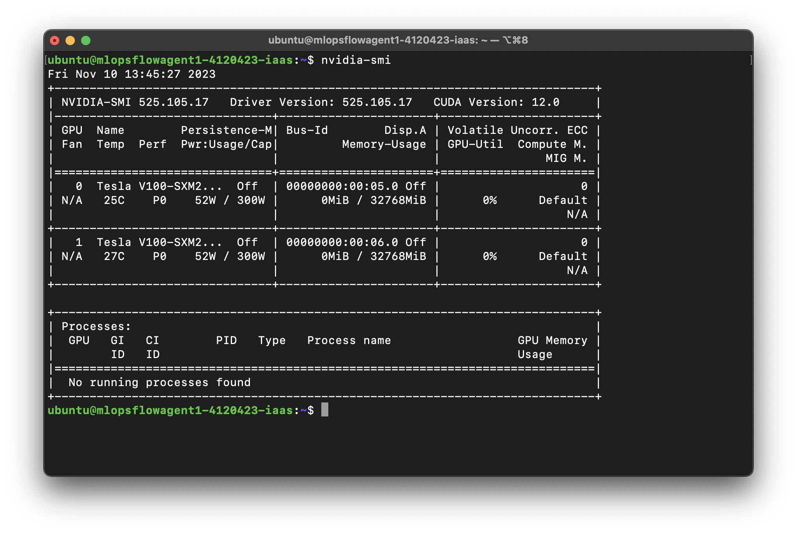
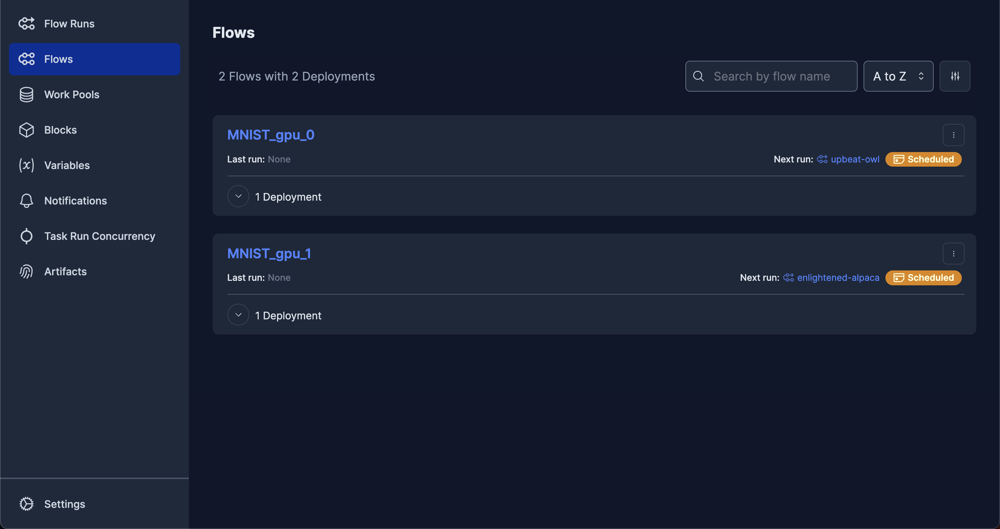
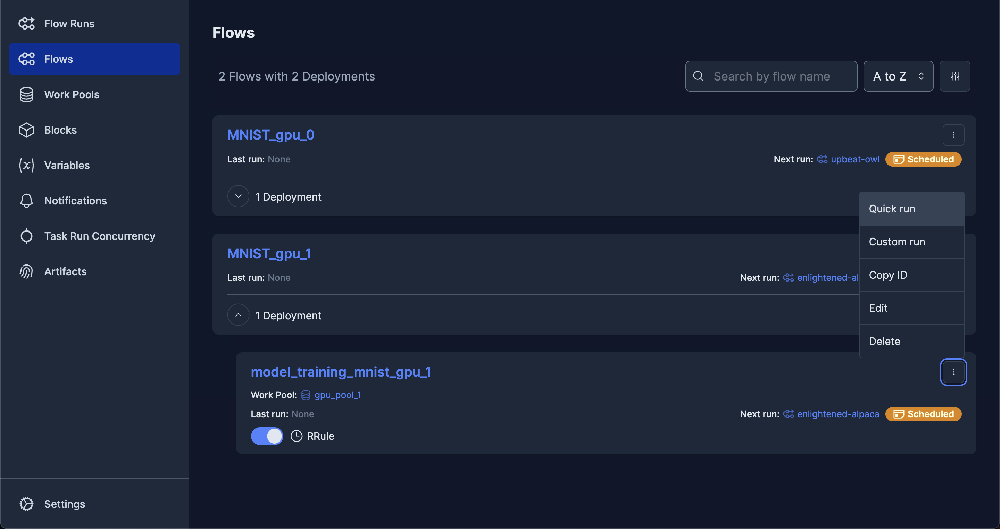
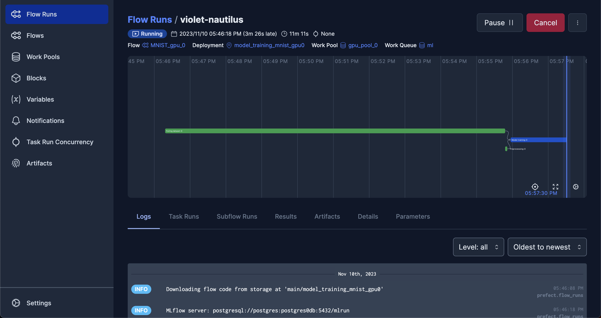
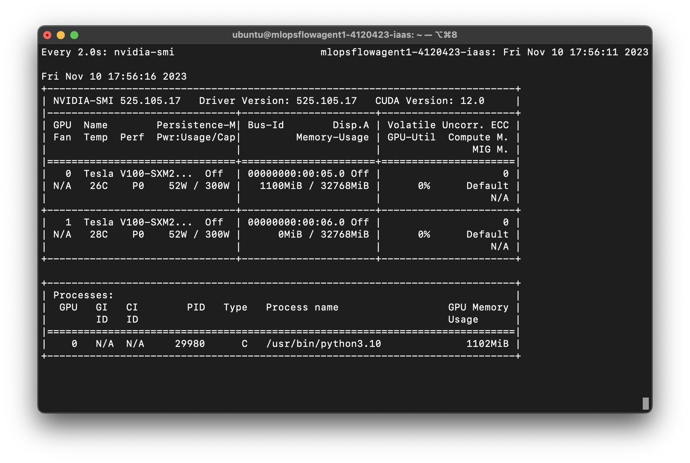

# 建立多GPU實驗環境

## 1 範例介紹
多人團隊進行協作時，如果有多個GPU的裝置，就能善用每一個GPU作為一個Agent來同時執行多個排程。在此範例中我們將建立適合多人使用的[Prefect Work pools](https://docs.prefect.io/2.14.3/concepts/work-pools/)，模擬當手上有多GPU，又有多個排程要進行時可以怎麼使用Prefect。

主要步驟有：
1. 在每一張GPU上各自建立Prefect Agent
2. 建立多個排程，並上傳到不同的GPU裝置

## 2 實作
**注意事項：**
此範例需要用到[0-Quick-install](https://)所建立的服務（MinIO、Prefect、MLflow等），實作前須確認上述服務都正常運作。

首先開啟[NVIDIA System Management Interface](https://developer.nvidia.com/nvidia-system-management-interface)來確認顯示卡以及[CUDA](https://www.nvidia.com/zh-tw/geforce/technologies/cuda/)是否已設定好：



假如能看到所有已裝備的GPU以及CUDA版本，就完成前置作業了。如果未能看到設備安裝的GPU，可能是因為沒有正確安裝驅動程式。

## 2.1 透過Prefect建立2個排程
在此範例略過伺服器的建立步驟，並假設伺服器已經建立好。我們首先要將2個名為「MNIST1」、「MNIST2」的排程分別上傳到同一個Prefect伺服器上：

### 2.1.1 複製`MNIST.dvc`，讓DVC能從遠端下載資料
將`flows_mnist/data/MNIST.dvc`分別拷貝到`flow_scheduler/flows_mnist_gpu_0/data/`、`flow_scheduler/flows_mnist_gpu_1/data/`。此步驟的用意是讓兩個資料夾都要有`MNIST.dvc`，才能從DVC遠端下載資料。


### 2.1.2 分別建立兩個排程，上傳到Prefect伺服器
#### 2.1.2-a 建立「MNIST_gpu_0」排程
如果是在單GPU設備，就不需要執行2.1.2-b。

建立Docker Compose之前請確認`flow_scheduler/flow_scheduler/.env`裡面的`FLOW_DIR`設定為「`FLOW_DIR='./flows_mnist_gpu_0'`」。

````commmandline
cd flow_scheduler/flow_scheduler/
docker compose up -d --build
````

#### 2.1.2-b 建立「MNIST_gpu_1」排程
此步驟跟2.1.2-a在相同的路徑下執行，但因為這兩個步驟是要建立不同排程，因此要上傳不同的`flows`資料夾。建立Docker Compose之前請先到`flow_scheduler/flow_scheduler/.env`裡面的`FLOW_DIR`更改設定為「`FLOW_DIR='./flows_mnist_gpu_1'`」。

````commmandline
cd flow_scheduler/flow_scheduler/
docker compose up -d --build
````

## 2.2 分別建立兩個Prefect Agent
建立Agent的詳細說明請見[0-Quick-install](https://)。

### 2.2.1 建立「gpu_pool_0」

如果是在單GPU設備，就不需要執行2.2.2。
````commmandline
cd flow_agent_pool_ml_gpu_0/
docker compose up -d --build
````

### 2.2.2 建立「gpu_pool_1」
````commmandline
cd flow_agent_pool_ml_gpu_1/
docker compose up -d --build
````

## 2.3 到Prefect UI確認
前往`http://localhost:4200/`，進到Prefect UI確認剛才建立的排程是否有出現。



如果還沒到排程的時間，程式就不會開始執行，我們可以用以下方式來快速執行一次：
1. 展開「MNIST_gpu_0」或「MNIST_gpu_1」，會看到「model_training_mnist_gpu_0」或「model_training_mnist_gpu_1」，以下截圖是展開「MNIST_gpu_1」的樣子
2. 點一下該卡片的右上角的「⋮」按鈕，點一下「Quick run」即可快速執行一次


Flow Run隨即開始執行：


到目前為止我們已經實際操作完CPU與GPU Agent的建立，並用來進行模型訓練，未來就能依設備與需求，自行組合出最適合團隊使用的Prefect pool。

## 3 補充
### 如何確認不同Pool所使用的GPU代號
可以只執行一個Pool，透過`nvidia-smi`觀察該Pool所使用的GPU，是否與執行另一個Pool時有所不同。例如在此範例中，只執行`gpu_pool_0`的Pool，就會只使用到GPU 0的資源。

> 使用「`watch`」工具定期執行`nvidia-smi`，就能隨時監控顯示卡運作情形。但由於該工具不會自動更新，我們可以在終端機輸入「`watch nvidia-smi`」，定期更新輸出資訊，例如下圖：


### 在Docker Compose指定使用某個GPU的方式
以`flow_agent_pool_ml_gpu_0/docker-compose.yml`為範例（只保留跟GPU設定相關的內容，其他省略），只要在`deploy.resources.reservations`項目指定好`device_ids`，就能指定要使用哪一個GPU來執行這個Pool裡面的任務，例如：

````yaml
    deploy:
      resources:
        reservations:
          devices:
            - driver: nvidia
              device_ids: ["0"]  # <-- 使用id = 0的GPU
              capabilities: [gpu]
````
就能使用代號為0的GPU。
