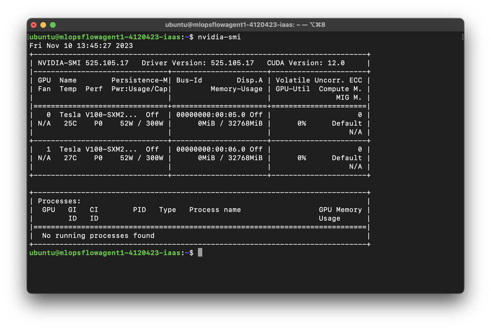
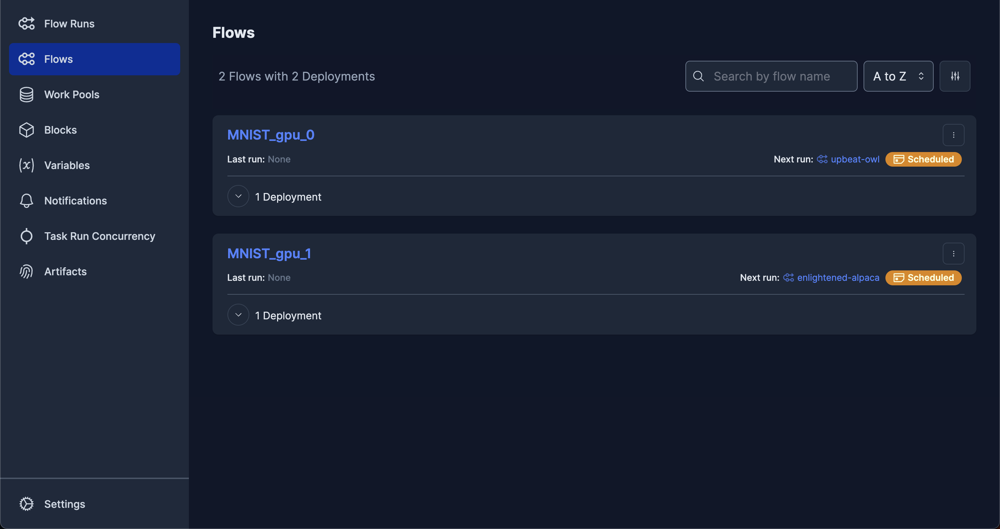
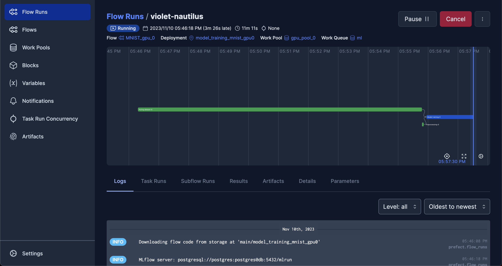

# 案例D-多人協作時，如何建立多GPU實驗環境

## 1 範例介紹
多人團隊進行協作時，如果有多GPU的電腦，就能善用每一個GPU作為一個Agent來執行排程，達到分配資源。在此範例中我們將建立適合多人使用的[Prefect Work pools](https://docs.prefect.io/2.14.3/concepts/work-pools/)，模擬當手上有多GPU，又有多個排程要進行時可以怎麼安排。

主要步驟有：
1. 建立MinIO、MLflow、Prefect等三項工具，建立方式請見範例0
2. 在每一張顯示卡上各自建立Prefect Agent
3. 使用者建立多個排程，並上傳到不同的GPU裝置

## 2 實作
以下的操作流程皆在本機端建置，範例使用的設備配有2個NVIDIA Tesla V100 GPU，並已預先安裝好顯示卡所需的相關驅動程式。

首先開啟[NVIDIA System Management Interface](https://developer.nvidia.com/nvidia-system-management-interface)來確認顯示卡以及[CUDA](https://www.nvidia.com/zh-tw/geforce/technologies/cuda/)是否已設定好：



假如能看到所有已裝備的GPU以及CUDA版本，就完成前置作業了。如果未能看到設備安裝的GPU，可能是因為沒有正確安裝驅動程式。

## 2.1 透過Prefect建立2個排程
在此範例略過伺服器的建立步驟，並假設伺服器已經建立好。我們首先要將2個名為「MNIST1」、「MNIST2」的排程分別上傳到同一個Prefect伺服器上：

### 2.1.1 複製MNIST.dvc，讓DVC能從遠端下載資料
將`flows_mnist/data/MNIST.dvc`分別拷貝到`flow_scheduler/flows_mnist_gpu_0/data/`、`flow_scheduler/flows_mnist_gpu_1/data/`。兩個資料夾都要有`MNIST.dvc`才能從DVC遠端下載資料。

### 2.1.2 分別建立兩個排程，上傳到Prefect伺服器
#### 2.1.2.1 建立「MNIST_gpu_0」排程
建立Docker Compose之前請確認`flow_scheduler/flow_scheduler/.env`裡面的`FLOW_DIR`設定為「`FLOW_DIR='./flows_mnist_gpu_0'`」。

````commmandline
cd flow_scheduler/flow_scheduler/
docker compose up -d --build
````

#### 2.1.2.2 建立「MNIST_gpu_1」排程
此步驟跟2.1.2.1在相同的路徑下執行，但因為這兩個步驟是要建立不同排程，因此要上傳不同的`flows`資料夾。建立Docker Compose之前請先到`flow_scheduler/flow_scheduler/.env`裡面的`FLOW_DIR`更改設定為「`FLOW_DIR='./flows_mnist_gpu_1'`」。

````commmandline
cd flow_scheduler/flow_scheduler/
docker compose up -d --build
````

## 2.2 分別建立兩個Prefect Agent
建立Agent的詳細說明請見範例0。

### 2.2.1 建立「gpu_pool_0」
````commmandline
cd flow_agent_pool_ml_gpu_0/
docker compose up -d --build
````

### 2.2.1 建立「gpu_pool_1」
````commmandline
cd flow_agent_pool_ml_gpu_1/
docker compose up -d --build
````

## 2.3 到Prefect UI確認
前往`http://localhost:4200/`，進到Prefect UI確認剛才建立的排程是否有出現。



如果還沒到排程的時間，展開「MNIST」，到「model_training_mnist_gpu_0」以及「model_training_mnist_gpu_1」卡片的右上角點選選項按鈕，點一下「Quick run」即可快速執行一次。


Flow Run隨即開始執行：



可以只執行一個Pool，透過`nvidia-smi`觀察該Pool所使用的GPU，是否與執行另一個Pool時有所不同。例如在此範例中，只執行`gpu_pool_0`的Pool，就會指使用到GPU 0的資源。

> 使用「`watch`」工具定期執行`nvidia-smi`，就能隨時監控顯示卡運作情形。在終端機輸入「`watch nvidia-smi`」就能看到其輸出資訊定期更新，預設值為2秒更新一次，如下圖：


## 3 補充
### 在Docker Compose指定使用某個GPU的方式
以`flow_agent_pool_ml_gpu_0/docker-compose.yml`為範例（只保留跟GPU設定相關的內容，其他省略），只要在`deploy.resources.reservations`項目指定好`device_ids`，就能指定要使用哪一個GPU來執行這個Pool裡面的任務，例如：

````yaml
    deploy:
      resources:
        reservations:
          devices:
            - driver: nvidia
              device_ids: ["0"]  # <-- 使用id = 0的GPU
              capabilities: [gpu]
````
就能使用代碼為0的GPU。
