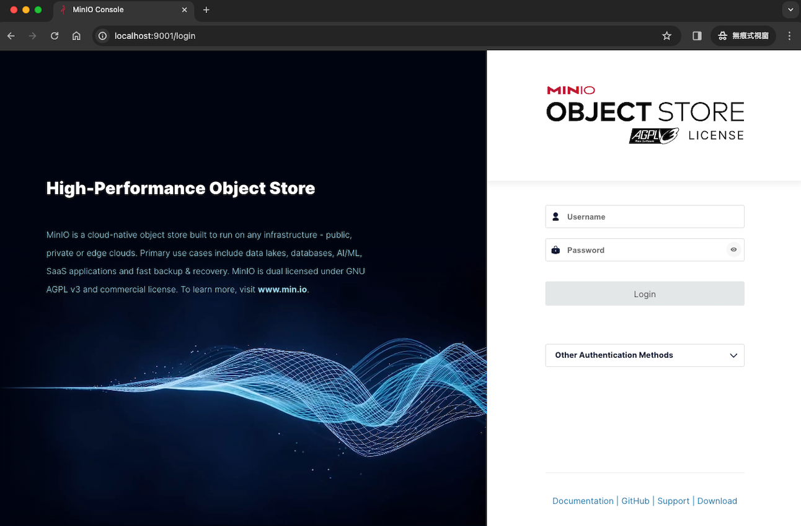

# 快速安裝 - 單機 + CPU 排程執行服務
此章節旨在說明如何快速安裝 MLOps 服務在本地電腦，並試運行各個相關服務/功能。其中， `工作流程的執行服務` 為 CPU 版本，如需 GPU 版本請參考其他章節。更多客製化安裝、套件功能介紹，請參考 `User Guide` 章節。<br>


## 系統架構


## 事前準備
1. 請先安裝 `git` 套件 ([下載教學](https://git-scm.com/book/zh-tw/v2/%E9%96%8B%E5%A7%8B-Git-%E5%AE%89%E8%A3%9D%E6%95%99%E5%AD%B8)) 與 `docker` 套件 ([官網下載](https://www.docker.com/products/docker-desktop/))
2. 下載此專案
```
git clone https://github.com/AIF-TW/MLOps-is-all-you-need.git
```
3. 進入此專案資料夾
```
cd MLOps-is-all-you-need
```

## 檔案結構
包含 4 個服務/功能
- 伺服器 `server`
- 開發環境 `ml_experimenter`
- 工作流程的排程功能 `flow_scheduler` 
- 工作流程的執行服務`flow_agent` (本章節為 CPU 版，如需 GPU 版請參考相關章節)

<details><summary>展開檔案結構圖</summary>
<p>

```
.
├── README.md
├── flow_agent
│   └── default-agent-pool_ml_cpu
│       ├── .env
│       ├── Dockerfile
│       ├── docker-compose.yml
│       ├── requirements.txt
│       └── requirements_sys.txt
├── flow_scheduler
│   ├── flow_scheduler
│   │   ├── .env
│   │   ├── Dockerfile
│   │   ├── docker-compose.yml
│   │   ├── requirements_sys.txt
│   │   └── setup.py
│   └── flows
│       └── example_flow # 範例排程專案
│           ├── data
│           │   ├── green_tripdata_2021-01.parquet
│           │   └── green_tripdata_2021-02.parquet
│           ├── flow.yaml
│           ├── prefect_flow.py
│           └── requirements.txt
├── ml_experimenter
│   ├── .env
│   ├── local-setup.sh
│   └── requirements_sys.txt
└── server
    ├── .env
    ├── docker-compose.yml
    ├── init.sh
    └── prefect_setting_s3.py
```

</p>
</details>

## 開始安裝
請依序完成以下4個服務/功能的安裝。

### 伺服器 Server

1. 進入到  `server` 資料夾，並啟動伺服器服務
   ```
   cd server
   docker-compose up --build
   ```

2. 完成後，可以看到包含以下紀錄，表示各項服務正常啟動
- MinIO (容器名：`minio_s3`)
    ```
    MinIO Object Storage Server
    Copyright: 2015-2023 MinIO, Inc.
    License: GNU AGPLV3 <https://www.gnu.org/licenses/agpl-3.0.htmb
    Verston: RELEASE. 2023-10-25T06-33-25Z (go1.21.3 Linux/arm64)

    Status:         1 Online, o Offline.
    S3-API:http://172.19.0.2:9000 http://127.0.0.19090
    Console:http://172.19.0.2:9001http://127.0.0.1:9001

    Documentation:https://min.io/docs/minto/linux/index.html
    Warning: The standard parity is set to 0. This can lead to data loss
    ```
- MLflow (容器名：`mlflow_server`)
    ```
    [2023-11-01 05:43:49 +0000] [33] [INFO] Starting gunicorn 20.1.0
    [2023-11-01 05:43:49 +0000] [33] [INFO]Listening at:http://0.0.0.0:5050(33)
    [2023-11-01 05:43:49 +0000] [33] [INFO] Using worker: sync
    [2023-11-01 05:43:49 +0000] [34] [INF0]Booting worker with pid:34
    [2023-11-01 05:43:49 +0000] [35] [INFO] Booting worker with pid:35
    [2023-11-01 05:43:49 +0000] [36] [INF0] Booting worker withpid:36
    [2023-11-01 05:43:49 +0000] [37] [INFO] Booting worker with pid:37
    ```
- Prefect (容器名：`prefect_server`)
    ```
    Successfully registered 1 block

    ┏━━━━━━━━━━━━━━━━━━━━┓
    ┃ Registered Blocks  ┃
    ┡━━━━━━━━━━━━━━━━━━━━┩
    │ Remote File System │
    └────────────────────┘

    To configure the newly registered blocks, go to the Blocks page in the Prefect 
    UI.


    ___ ___ ___ ___ ___ ___ _____ 
    | _ \ _ \ __| __| __/ __|_   _| 
    |  _/   / _|| _|| _| (__  | |  
    |_| |_|_\___|_| |___\___| |_|  

    Configure Prefect to communicate with the server with:

        prefect config set PREFECT_API_URL=http://0.0.0.0:4200/api

    View the API reference documentation at http://0.0.0.0:4200/docs

    Check out the dashboard at http://0.0.0.0:4200
    ```
- Postgres (容器名：`postgres_db`)
    ```
    PostgreSQL Database directory appears to contain a database; Skipping initialization

    2023-11-13 08:30:16.122 UTC [1] LOG:  starting PostgreSQL 15.4 (Debian 15.4-1.pgdg120+1) on x86_64-pc-linux-gnu, compiled by gcc (Debian 12.2.0-14) 12.2.0, 64-bit
    2023-11-13 08:30:16.122 UTC [1] LOG:  listening on IPv4 address "0.0.0.0", port 5432
    2023-11-13 08:30:16.122 UTC [1] LOG:  listening on IPv6 address "::", port 5432
    2023-11-13 08:30:16.270 UTC [1] LOG:  listening on Unix socket "/var/run/postgresql/.s.PGSQL.5432"
    2023-11-13 08:30:16.518 UTC [29] LOG:  database system was shut down at 2023-11-13 08:29:54 UTC
    2023-11-13 08:30:16.688 UTC [1] LOG:  database system is ready to accept connections
    ```

3. 確保正常啟動後，可以透過在瀏覽器輸入對應的網址，開始使用以下 GUI 的服務
- MinIO (網址: `http://localhost:9001`)


- MLflow (網址: `http://localhost:5050`)


- Prefect (網址: `http://localhost:4200`)


### 開發環境 ML Experimenter
1. 將 `ml_experimenter` 中的檔案複製到你將要啟動的專案資料夾，並進入該資料夾進行專案初始化 (此範例示範直接以 `ml_experimenter` 作為專案資歷夾)

    > 註：如果是 Windows作業系統，請在 Git Bash 執行 下方指令 (Git Bash 會在下載 Git 套件的時候一併下載，使用方式請參考 [如何在VScode 使用 git bash](https://code.visualstudio.com/docs/sourcecontrol/intro-to-git#_git-bash-on-windows))

    ```
    cd ml_experimenter
    source local-setup.sh
    ```

2. 完成後，可以在終端機看到以下結果，表示專案初始化正常
    ```
    ==========================
    Done & Enjoy Your Project!
    ==========================
    Note. DVC remote strage name: minio_s3
    ```

3. 可以在這個資料夾開始你的專案開發了！

### 工作流程的排程功能 Flow Scheduler
此功能在快速安裝時，僅利用範例專案做測試。詳細使用方法請參考 `快速使用` 章節。

1.  進入`工作流程的排程功能` 並啟動

    ```
    cd flow_scheduler/flow_scheduler
    docker-compose up --build
    ```
2. 完成後會顯示以下紀錄，表示範例專案已經成功上傳到 `Prefect` 排程服務
    ```
    Work pool named 'default-agent-pool' already exists. Please try creating your work pool again with a different name.
    Found flow 'main'
    Default '.prefectignore' file written to /root/flows/.prefectignore
    Deployment YAML created at '/root/flows/main-deployment.yaml'.
    Successfully uploaded 8 files to s3://prefect/main/model_training
    Deployment 'main/model_training' successfully created with id
    'b84cb77c-9a5b-4575-b603-4d95f84d0e3c'

    To execute flow runs from this deployment, start an agent that pulls work from
    the 'default-agent-pool' work pool:
    $ prefect agent start -p 'default-agent-pool'
    ```

3. 同時也可以在 `Prefect` 的 GUI 介面看到新加入的排程

{background-color:transparent}

### 工作流程的執行服務 Flow Agent
此服務在快速安裝時，僅利用範例專案做測試，測試後刪除。詳細使用方法請參考 `快速使用` 章節。

1. 進入 `工作流程的執行服務` 的 cpu 範例服務資料夾，並啟動範例服務
    ```
    cd flow_agent/default-agent-pool_ml_cpu
    docker-compose up --build
    ```

2. 完成後，會顯示以下紀錄，表示此服務正常啟用
    ```
    Starting v2.10.9 agent connected to http://prefect_server:4200/api...

    ___ ___ ___ ___ ___ ___ _____     _   ___ ___ _  _ _____
    | _ \ _ \ __| __| __/ __|_   _|   /_\ / __| __| \| |_   _|
    |  _/   / _|| _|| _| (__  | |    / _ \ (_ | _|| .` | | |
    |_| |_|_\___|_| |___\___| |_|   /_/ \_\___|___|_|\_| |_|


    Agent started! Looking for work from work pool 'cpu_pool'...
    ```

3. 最後，刪除服務
    - 先中止服務：在終端機輸入 `control + c`
    - 刪除服務：在終端機輸入
        ```
        docker-compose down 
        ```