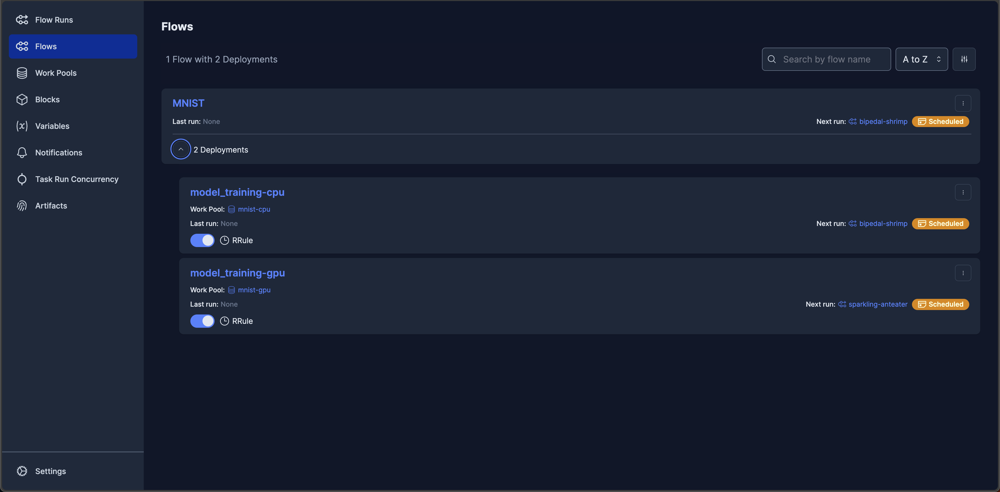
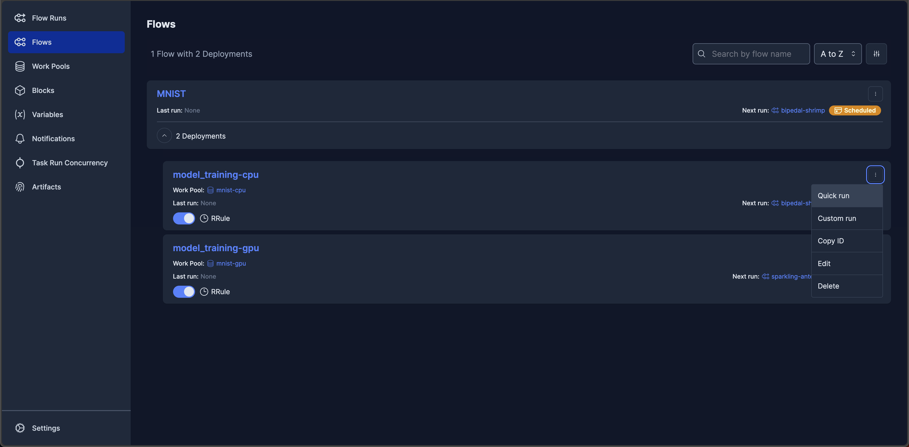
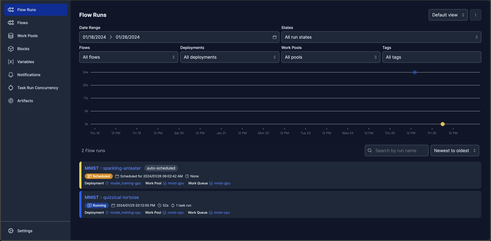
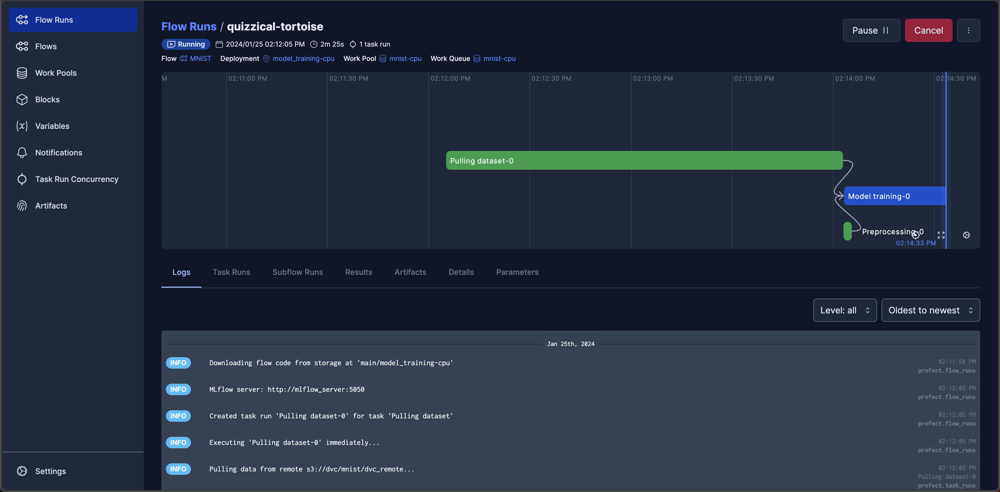

# 以 MNIST 實作系統建置與執行實驗
這份範例是透過手寫數字辨識模型的開發，實際操作以下步驟：
- 進行資料版本控制
- 在模型實驗階段，訓練模型並追蹤模型結果
- 模型穩定後，對模型的定期再訓練進行自動化排程
- 運用 CPU 和 GPU 資源來執行排程

## 目錄
- [使用工具](#使用工具)
- [環境需求](#運行環境需求)
- [工作資料夾結構](#工作資料夾結構)
- [執行步驟](#執行步驟)
    - [安裝專案所需套件](#0-安裝mnist專案所需套件)
    - [資料版本控制](#1-資料版本控制)
    - [實驗性的訓練](#2-實驗性的訓練)
    - [模型定期訓練的排程](#3-模型定期訓練的排程)
    - [測試](#4-測試)

## 使用工具
* [MinIO](https://min.io)：提供[物件儲存](https://aws.amazon.com/tw/what-is/object-storage/)服務。
* [Prefect](https://www.prefect.io)：把定期執行的任務進行排程，並透過 [Prefect Agent](https://docs.prefect.io/latest/concepts/agents/) 執行，使用者能隨時透過其 UI 監控每個工作的狀態。
* [MLflow](https://mlflow.org)：MLflow 能用來追蹤模型、紀錄實驗結果，以及做到模型版本控制。
* [Data Version Control (DVC)](https://dvc.org)：DVC 是著名的開源資料版本控制工具，操作邏輯與 [Git](https://git-scm.com) 類似。

## 環境需求
1. 需要確認以下服務正常運作：
* MinIO
* Prefect
* MLflow

2. 此範例的所有步驟都需要在 [`quick_install`](/projects/quick_install/) 建立的環境 `mlops` 操作。
> 如果尚未進到 `mlops` 環境，可以開啟新的終端機視窗，並執行 `conda activate mlops` 來進入環境。

## 工作資料夾結構
```
mnist
├── README.md
├── dev
│   ├── .dvcignore
│   ├── data_version.sh
│   ├── mnist.py
│   ├── requirements.txt
│   └── upload_dvc_file_to_minio.py
├── flow
│   ├── config
│   │   ├── dataset.yml
│   │   ├── flow.yml
│   │   └── hyp.yml
│   ├── flow.py
│   └── requirements.txt
└── img
```
* `dev/`: 開發階段的相關檔案
  - `.dvcignore`: 讓 DVC 忽略特定的檔案
  - `data_version.sh`: 用來完成資料版本控制的 Shell 檔
  - `mnist.py`: 執行模型訓練任務的 Python 檔
  - `requirements.txt`: 執行任務所需的套件清單
  - `upload_dvc_file_to_minio.py`: 用來上傳 `data.dvc` 到 S3
  - `MNIST.zip`: 此檔案在執行 `data_version.sh` 時才會自動下載，內容為訓練資料與測試資料，解壓縮後會產生 `MNIST/` 資料夾

* `flow/`: 排程階段的相關檔案
  - `config/`: 放置任務的各項設定值
    - `dataset.yml`: 資料集相關設定，例如資料的路徑
    - `flow.yml`: 排程相關設定
    - `hyp.yml`: 模型超參數設定
  - `flow.py`: 要讓 Prefect 自動執行的 Python 檔
  - `requirements.txt`: 執行任務所需的套件清單

## 執行步驟
### 0. 安裝 `mnist` 專案所需套件
````shell
cd ~MLOps-is-all-you-need/projects/mnist/dev/
pip install -r requirements.txt
````

### 1. 資料版本控制
在與上一步同樣的路徑執行 `data_version.sh`：
````shell
bash ./data_version.sh
````
執行 `data_version.sh` 目的是為了使用 DVC 來對訓練資料進行版本控制，執行的動作有以下幾點，可以展開來查看較詳細的說明：
<details>
  <summary>將 <code>data/</code> 資料夾加入追蹤，建立 v1.0 的資料集</summary>

````shell
source ../../../mlops-sys/ml_experimenter/.env.local

# 下載資料集MNIST.zip
gdown "https://drive.google.com/file/d/1Ps26tCIFAXzrwXgHXC0BT3l_f0IvGrTd/view?usp=share_link" -O MNIST.zip --fuzzy
# 若無法下載，可以使用瀏覽器打開以上連結來手動下載

mkdir data
if [ -e data/MNIST ]; then
    echo 'data/MNIST/ exists.'
else
    unzip MNIST.zip -d data/
fi

# 製作v1.0的訓練資料，並讓DVC開始追蹤
git init  # 需要先以git對資料夾進行初始化
dvc init  # DVC對資路夾進行初始化
dvc add data  # 將MNIST資料夾以DVC追蹤
git add data.dvc .gitignore
git commit -m "First version of training data."  # 以git對.dvc進行版控
git tag -a "v1.0" -m "Created dataset."  # 建立標籤，未來要重回某個版本時比較方便 
````
</details>

<details>
  <summary>推送至 DVC remote</summary>

````shell
# 製作v1.0的訓練資料，並讓DVC開始追蹤
git init  # 需要先以git對資料夾進行初始化
dvc init  # DVC對資路夾進行初始化
dvc add data  # 將MNIST資料夾以DVC追蹤
git add data.dvc .gitignore
git commit -m "First version of training data."  # 以git對.dvc進行版控
git tag -a "v1.0" -m "Created dataset."  # 建立標籤，未來要重回某個版本時比較方便 

# ----------- dvc remote setting -----------
dvc remote add -f minio_s3 $MINIO_S3_PROJECT_BUCKET/dvc_remote  # remote為自定義的遠端名稱
dvc remote modify minio_s3 endpointurl $MLFLOW_S3_ENDPOINT_URL
dvc remote modify minio_s3 access_key_id $AWS_ACCESS_KEY_ID
dvc remote modify minio_s3 secret_access_key $AWS_SECRET_ACCESS_KEY
# ------------------------------------------

dvc push -r minio_s3  # 推送至minio_s3
````
</details>

<details>
  <summary>增加一些資料，作為 v2.0 的資料集，同樣也推送到 DVC remote</summary>

````shell
# 將更多訓練資料加入train/
for ((digit=0; digit<=9; digit++))
do
    mv ./data/MNIST/train_v2/$digit/* ./data/MNIST/train/$digit/
done
rm -r ./data/MNIST/train_v2/

# 製作v2.0的訓練資料
dvc add data
git add data.dvc
git commit -m "Add some images"
git tag -a "v2.0" -m "More images added."
dvc push -r minio_s3
#git push  # 如果有遠端的git repo才需要執行

python3 upload_dvc_file_to_minio.py  # 將MNIST.dvc上傳至MinIO
````
</details>

### 2. 實驗性的訓練
````shell
cd ~MLOps-is-all-you-need/projects/mnist/dev/
python3 mnist.py
````
執行 `~MLOps-is-all-you-need/projects/mnist/mnist.py` 的所有步驟，完成一次模型訓練並且用 MLflow 追蹤訓練結果。

<details>
<summary>
如何在 MLflow UI 檢視實驗結果
</summary>

進入 MLflow UI 後，於畫面左側實驗名稱點選「MNIST」，進入到這個實驗的頁面：


進入實驗後，點選某一次的執行即可檢視結果：

> 可以展開左側「Parameters」檢視模型訓練時的超參數，或是展開「Metrics」確認模型指標。

</details>

### 3. 模型定期訓練的排程
#### 3.1. 將排程上傳到Prefect伺服器
打開 `~MLOps-is-all-you-need/mlops-sys/flow_scheduler/.env.local`，更改以下設定：
```
# FLOW_DIR = '../../flows/example_flow' # project directory of your flow.py
改為
FLOW_DIR = '../../projects/mnist/flow' # project directory of your flow.py
```

執行以下指令將排程資料上傳到 Prefect 伺服器：
````shell
cd ~MLOps-is-all-you-need/mlops-sys/flow_scheduler/
docker compose -f docker-compose-local.yml --env-file ./.env.local up --build
````

這個步驟的目的是將工作資料夾（就是 `~MLOps-is-all-you-need/projects/mnist/flow/` ）上傳到 Prefect 伺服器，並且製作排程。當容器成功建立，會看到包含以下文字的訊息：
````
 ✔ Container flow_scheduler  Recreated
flow_scheduler  | Work pool named 'mnist-cpu' already exists. Please try creating your work pool 
flow_scheduler  | again with a different name.
flow_scheduler  | Found flow 'MNIST'
flow_scheduler  | Default '.prefectignore' file written to /root/flows/.prefectignore
flow_scheduler  | Deployment YAML created at '/root/flows/main-deployment.yaml'.
flow_scheduler  | Successfully uploaded 8 files to s3://prefect/main/model_training
flow_scheduler  | Deployment 'MNIST/model_training' successfully created with id 
flow_scheduler  | '476b5fc2-cb78-4e32-99ea-961ee84873a0'.  # 在你的環境執行時，可能會看到不同的id
flow_scheduler  | 
flow_scheduler  | To execute flow runs from this deployment, start an agent that pulls work from 
flow_scheduler  | the 'mnist-cpu' work pool:
flow_scheduler  | 
flow_scheduler  | $ prefect agent start -p 'mnist-cpu'
flow_scheduler exited with code 0
````
> 訊息顯示排程已上傳至 Prefect 伺服器，正等待 Prefect Agent 來執行這個排程，接下來就要啟動另一個容器來建立 Prefect Agent。

#### 3.2. 建立 Prefect CPU Agent 來執行排程
啟動 Prefect CPU Agent：
````shell
cd ~MLOps-is-all-you-need/mlops-sys/flow_agent/cpu_pool_mnist_local_cpu/
docker compose up --build -d
````
> 在 `docker compose up` 後加上 `-d`，就能讓 Docker 不佔用一個終端機視窗。

Prefect Agent 會依照排程指定的時間自 Prefect 伺服器下載工作資料夾，並執行指定的 Python 檔，不過要注意的是此 Python 檔必須配合 [Prefect 規定的方式](https://docs.prefect.io/latest/tutorial/flows/)撰寫，可參考[ `quick_start` ](/projects/quick_start/flow/prefect_flow.py)。

<details><summary>

#### 3.3. 建立 Prefect GPU Agent 排程
</summary>

  如果電腦配有 NVIDIA GPU，可以執行這個段落來建立 GPU Agent。
  **需要先確認 [CUDA](https://www.nvidia.com/zh-tw/geforce/technologies/cuda/) 已設定好，且 CUDA Version 為 11.6 以上。**

  <details>
  <summary>
  確認方式：

  </summary>

  在終端機執行 `nvidia-smi` 來開啟 [NVIDIA System Management Interface](https://developer.nvidia.com/nvidia-system-management-interface)，假如能看到所有已裝備的 GPU 以及 CUDA 版本，如下列範例，就代表所需的驅動都已裝好。如果未能看到設備安裝的 GPU，可能是因為沒有正確安裝驅動程式。
  ````
  (mlops) aif@aif_mlops:~$ nvidia-smi
  Thu Jan 25 14:46:01 2024       
  +-----------------------------------------------------------------------------+
  | NVIDIA-SMI 525.105.17   Driver Version: 525.105.17   CUDA Version: 12.0     |
  |-------------------------------+----------------------+----------------------+
  | GPU  Name        Persistence-M| Bus-Id        Disp.A | Volatile Uncorr. ECC |
  | Fan  Temp  Perf  Pwr:Usage/Cap|         Memory-Usage | GPU-Util  Compute M. |
  |                               |                      |               MIG M. |
  |===============================+======================+======================|
  |   0  Tesla V100-SXM2...  Off  | 00000000:00:05.0 Off |                    0 |
  | N/A   28C    P0    53W / 300W |      0MiB / 32768MiB |      0%      Default |
  |                               |                      |                  N/A |
  +-------------------------------+----------------------+----------------------+
  |   1  Tesla V100-SXM2...  Off  | 00000000:00:06.0 Off |                    0 |
  | N/A   26C    P0    53W / 300W |      0MiB / 32768MiB |      0%      Default |
  |                               |                      |                  N/A |
  +-------------------------------+----------------------+----------------------+
                                                                                
  +-----------------------------------------------------------------------------+
  | Processes:                                                                  |
  |  GPU   GI   CI        PID   Type   Process name                  GPU Memory |
  |        ID   ID                                                   Usage      |
  |=============================================================================|
  |  No running processes found                                                 |
  +-----------------------------------------------------------------------------+
  (mlops) aif@aif_mlops:~$ 

  ````

  </details>

  打開 `~MLOps-is-all-you-need/projects/mnist/flow/config/flow.yml`，更改以下 3 個設定並存檔：
  ```
  將原先的
  deploy_name: model_training-cpu  # 目的，如daliy_model、data_update

  pool_name: mnist-cpu  # 要調用的運算資源
  queue_name: mnist-cpu  # 專案名稱
  改為
  deploy_name: model_training-gpu  # 目的，如daliy_model、data_update

  pool_name: mnist-gpu  # 要調用的運算資源
  queue_name: mnist-gpu  # 專案名稱
  ```

  執行以下指令將排程資料上傳到 Prefect 伺服器（指令與 Prefect CPU Agent 相同）：
  ````shell
  cd ~MLOps-is-all-you-need/mlops-sys/flow_scheduler/
  docker compose -f docker-compose-local.yml --env-file ./.env.local up --build
  ````

  啟動 Prefect GPU Agent：
  ````shell
  cd ~MLOps-is-all-you-need/mlops-sys/flow_agent/mnist-gpu_mnist_single_gpu/
  docker compose up --build -d
  ````
</details>

### 4. 測試
在排程開始執行前我們需要進行測試，來確認排程可以正常執行，這邊以 CPU Agent 為例，。

進入 Prefect UI，在左側欄選擇「Flows」，確認畫面中是否出現「MNIST」


展開「MNIST」，到「model_training-cpu」卡片的右上角點選選項（ ⋮ ）按鈕，點一下「Quick run」來快速執行一次排程，畫面右下角會立即顯示這個任務的名稱（Prefect 會為每次任務隨機指派一個特定名稱）。


接著在左側欄位點選「Flow Runs」，點選任務名稱


就可以監控任務執行的狀態，可以看到各個任務的執行狀態都清楚的顯示出來

