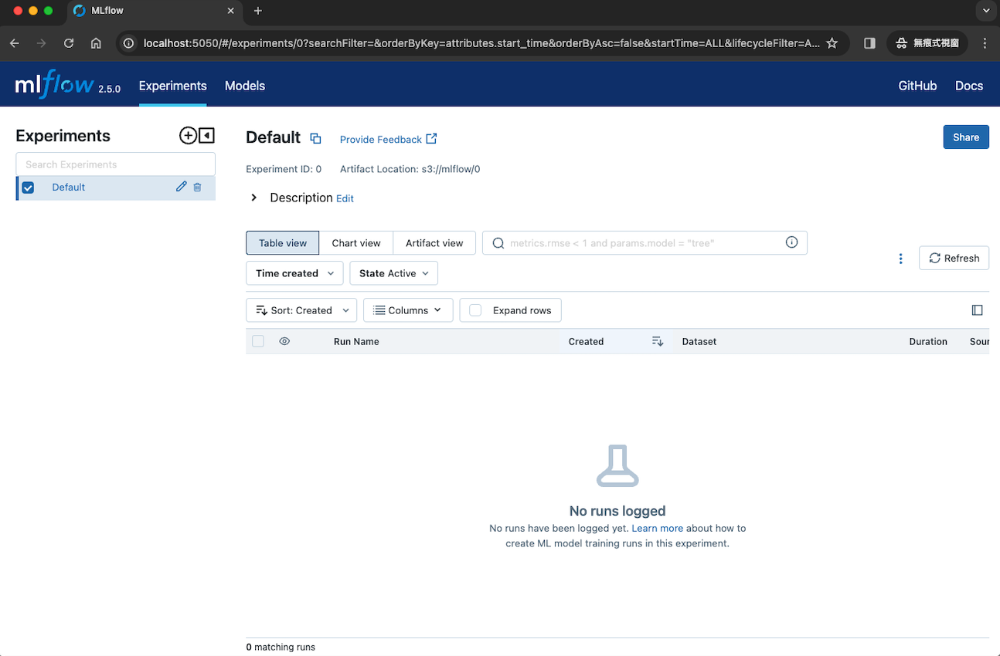
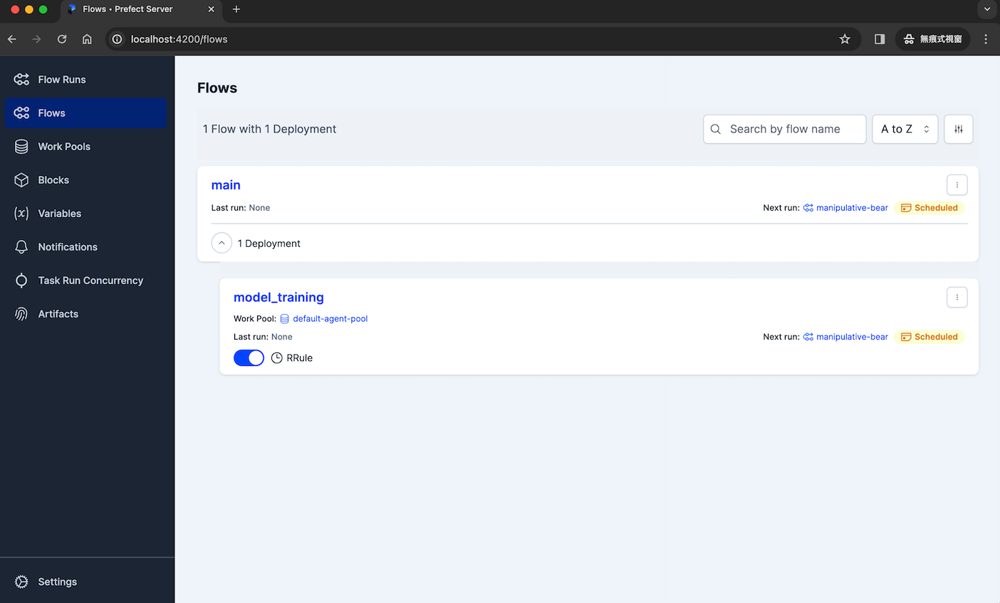

# 快速安裝
此章節旨在說明如何快速安裝 MLOps 服務在 本地電腦（以下稱 `單機模式`）或 多台電腦（以下稱 `多機模式`），並使用各個相關服務/功能。其中， `工作流程的執行服務` 包含 CPU 與 GPU 版本，請根據需求及電腦配置做設置。


## 事前準備
> 如果是 `多機模式`，請在所有電腦都執行下列步驟

1. 請先安裝需求套件： [`Git`](https://git-scm.com/book/zh-tw/v2/%E9%96%8B%E5%A7%8B-Git-%E5%AE%89%E8%A3%9D%E6%95%99%E5%AD%B8) 、 [`Docker`](https://www.docker.com/products/docker-desktop/) 、 [`Conda`](https://conda.io/projects/conda/en/latest/user-guide/install/index.html#)
    - 如果 `工作流程的執行服務` 需要使用 GPU，請在該電腦安裝 [`NVIDIA Container Toolkit`](https://docs.nvidia.com/datacenter/cloud-native/container-toolkit/latest/install-guide.html)

> 註：如果是 Windows作業系統，建議使用 Bash 執行此章節的指令，比如使用 `Git Bash` 執行。 `Git Bash` 會在下載 `Git` 套件的時候一併下載，使用方式請參考 [如何在VScode 使用 git bash](https://code.visualstudio.com/docs/sourcecontrol/intro-to-git#_git-bash-on-windows)。

2. 開啟終端機，下載此專案
    ```
    git clone https://github.com/AIF-TW/MLOps-is-all-you-need.git
    ```
3. 進入此專案主要功能的資料夾
    ```
    cd MLOps-is-all-you-need/mlops-sys
    ```


## 系統架構


## 檔案結構
包含 4 個服務/功能
- 伺服器 `server` (多機模式 將部署在 `電腦1`)
- 開發環境 `ml_experimenter` (多機模式 將部署在 `電腦2`)
- 工作流程的排程功能 `flow_scheduler` (多機模式 將部署在 `電腦3`)
- 工作流程的執行服務`flow_agent` (包含 CPU 和 GPU 兩種方案 & 多機模式 將部署在 `電腦4`)

<details><summary>展開檔案結構圖</summary>
<p>

```
.
├── flow_agent
│   ├── default-agent-pool_ml_distributed_cpu
│   │   ├── .env
│   │   ├── Dockerfile
│   │   ├── docker-compose.yml
│   │   ├── requirements.txt
│   │   └── requirements_sys.txt
│   ├── default-agent-pool_ml_distributed_gpu
│   │   ├── .env
│   │   ├── Dockerfile
│   │   ├── docker-compose.yml
│   │   ├── requirements.txt
│   │   └── requirements_sys.txt
│   ├── default-agent-pool_ml_local_cpu
│   │   ├── .env
│   │   ├── Dockerfile
│   │   ├── docker-compose.yml
│   │   ├── requirements.txt
│   │   └── requirements_sys.txt
│   ├── default-agent-pool_ml_local_gpu
│   │   ├── .env
│   │   ├── Dockerfile
│   │   ├── docker-compose.yml
│   │   ├── requirements.txt
│   │   └── requirements_sys.txt
│   ├── flow_agent_mnist_cpu
│   │   ├── .env
│   │   ├── Dockerfile
│   │   ├── docker-compose.yml
│   │   ├── requirements.txt
│   │   └── requirements_sys.txt
│   ├── flow_agent_pool_ml_cpu
│   │   ├── Dockerfile
│   │   ├── docker-compose.yml
│   │   ├── requirements.txt
│   │   └── requirements_sys.txt
│   ├── flow_agent_pool_ml_gpu_0
│   │   ├── Dockerfile
│   │   ├── docker-compose.yml
│   │   ├── requirements.txt
│   │   └── requirements_sys.txt
│   └── flow_agent_pool_ml_gpu_1
│       ├── Dockerfile
│       ├── docker-compose.yml
│       ├── requirements.txt
│       └── requirements_sys.txt
├── flow_scheduler
│   ├── .env
│   ├── .env.local
│   ├── Dockerfile
│   ├── docker-compose-local.yml
│   ├── docker-compose.yml
│   ├── requirements_sys.txt
│   └── setup.py
├── ml_experimenter
│   ├── .env
│   ├── .env.local
│   └── requirements_sys.txt
└── server
    ├── .env
    ├── .env.local
    ├── docker-compose-local.yml
    ├── docker-compose.yml
    ├── init.sh
    └── prefect_setting_s3.py
```

</p>
</details>

## 開始安裝
請依序完成以下4個服務/功能的安裝。

### 伺服器 Server
> `多機模式` 請在 `電腦1` 執行此段落

1. 取得此電腦的 `預設電腦IP`，此 IP 將作為其他服務/功能連線到 `伺服器 Server` 的依據，本章節接下來將以 `SERVER_IP` 指稱。

    <details><summary>取得預設電腦IP的方法參考</summary>
    <p>

    ```
    # 在終端機運行

    # linux
    ifconfig $(ip route | awk '/default/ {print $5}') | awk '/inet/ {print $2}' | head -n 2

    # mac
    ifconfig $(netstat -rn | awk '/default/ {print $4}' | head -n 1) | awk '/inet/ {print $2}'

    # linux/mac 輸出範例
    # fe80::f1e6:5c46:af01:7b34   --> IPv6
    # 172.16.110.13               --> IPv4 ， 請使用這個作為 MASTER_IP

    # windows
    ipconfig

    # windows 輸出範例
    # 無線區域網路介面卡 Wi-Fi:
    #    連線特定 DNS 尾碼 . . . . . . . . :
    #    連結-本機 IPv6 位址 . . . . . . . : fe80::4bdb:1045:4d34:f1a4%13
    #    IPv4 位址 . . . . . . . . . . . . : 172.16.110.107  --> 請使用有「預設閘道」的 IPv4 作為 MASTER_IP
    #    子網路遮罩 . . . . . . . . . . . .: 255.255.255.0    
    #    預設閘道 . . . . . . . . . . . . .: 172.16.110.1
    ```

    </p>
    </details>


2. 進入到  `server` 資料夾，並啟動伺服器服務
   ```
   # 單機模式
   cd server
   docker-compose -f docker-compose-local.yml --env-file .env.local up --build
   ```
    
   ```
   # 多機模式
   cd server
   export SERVER_IP=<SERVER_IP> # 請替換 SERVER_IP
   docker-compose up --build
   ```

3. 完成後，可以在終端機看到包含以下紀錄，表示各項服務正常啟動
- MinIO (容器名：`minio_s3`)
    ```
    MinIO Object Storage Server
    Copyright: 2015-2023 MinIO, Inc.
    License: GNU AGPLv3 <https://www.gnu.org/licenses/agpl-3.0.html>
    Version: RELEASE.2023-12-14T18-51-57Z (go1.21.5 linux/arm64)
    Status:         1 Online, 0 Offline. 
    S3-API:http://172.19.0.2:9000 http://127.0.0.1:9090
    Console:http://172.19.0.2:9001 http://127.0.0.1:9001

    Documentation:https://min.io/docs/minto/linux/index.html
    Warning: The standard parity is set to 0. This can lead to data loss
    ```
- MLflow (容器名：`mlflow_server`)
    ```
    [2023-11-01 05:43:49 +0000] [33] [INFO] Starting gunicorn 20.1.0
    [2023-11-01 05:43:49 +0000] [33] [INFO] Listening at:http://0.0.0.0:5050(33)
    [2023-11-01 05:43:49 +0000] [33] [INFO] Using worker: sync
    [2023-11-01 05:43:49 +0000] [34] [INFO] Booting worker with pid:34
    [2023-11-01 05:43:49 +0000] [35] [INFO] Booting worker with pid:35
    [2023-11-01 05:43:49 +0000] [36] [INFO] Booting worker with pid:36
    [2023-11-01 05:43:49 +0000] [37] [INFO] Booting worker with pid:37
    ```
- Prefect (容器名：`prefect_server`)
    ```
    Successfully registered 1 block

    ┏━━━━━━━━━━━━━━━━━━━━┓
    ┃ Registered Blocks  ┃
    ┡━━━━━━━━━━━━━━━━━━━━┩
    │ Remote File System │
    └────────────────────┘

    To configure the newly registered blocks, go to the Blocks page in the Prefect 
    UI.


    ___ ___ ___ ___ ___ ___ _____ 
    | _ \ _ \ __| __| __/ __|_   _| 
    |  _/   / _|| _|| _| (__  | |  
    |_| |_|_\___|_| |___\___| |_|  

    Configure Prefect to communicate with the server with:

        prefect config set PREFECT_API_URL=http://0.0.0.0:4200/api

    View the API reference documentation at http://0.0.0.0:4200/docs

    Check out the dashboard at http://0.0.0.0:4200
    ```
- Postgres (容器名：`postgres_db`)
    ```
    PostgreSQL Database directory appears to contain a database; Skipping initialization

    2023-11-13 08:30:16.122 UTC [1] LOG:  starting PostgreSQL 15.4 (Debian 15.4-1.pgdg120+1) on x86_64-pc-linux-gnu, compiled by gcc (Debian 12.2.0-14) 12.2.0, 64-bit
    2023-11-13 08:30:16.122 UTC [1] LOG:  listening on IPv4 address "0.0.0.0", port 5432
    2023-11-13 08:30:16.122 UTC [1] LOG:  listening on IPv6 address "::", port 5432
    2023-11-13 08:30:16.270 UTC [1] LOG:  listening on Unix socket "/var/run/postgresql/.s.PGSQL.5432"
    2023-11-13 08:30:16.518 UTC [29] LOG:  database system was shut down at 2023-11-13 08:29:54 UTC
    2023-11-13 08:30:16.688 UTC [1] LOG:  database system is ready to accept connections
    ```

4. 若有看到以上的成功訊息後，接著可以透過在瀏覽器輸入對應的網址，開始使用以下 GUI 的服務
    > 請將下方 `IP` 替換成 `localhost`(單機模式) 或是 `SERVER_IP` (多機模式)

- MinIO (網址: `http://IP:9001`，帳號：`admin`，密碼：`adminsecretkey`)


- MLflow (網址: `http://IP:5050`)


- Prefect (網址: `http://IP:4200`)


### 開發環境 ML Experimenter
> `多機模式` 請在 `電腦2` 執行此段落

1. `ml_experimenter` 包含建置開發環境需要的檔案，為確保開發環境獨立，我們先利用 conda 建立一個獨立開發環境 `mlops`，並進入該環境
    ```
    conad create -n mlops python=3.10 -y    # 建立獨立開發環境
    conda activate mlops                    # 進入該開發環境
    ```
3. 下載需要的 python 套件
    > 註：每個新的獨立環境都要重新下載一次
    ```
    cd ml_experimenter
    pip install -r requirements_sys.txt
    ```
4. 設定環境變數
    > 註：每次使用新的終端機介面都需要重新設定環境變數。
    ```
    # 單機模式
    cd ml_experimenter
    source .env.local
    ```
    
    ```
    # 多機模式
    cd ml_experimenter
    export SERVER_IP=<SERVER_IP> # 請替換 SERVER_IP
    source .env
    ```
5. [可選擇] 建立一個資料夾，例如 [`example_project`](../../dev-projects/example_project) ，並初始化 DVC 資料版本控制服務 
    ```
    git init
    dvc init
    dvc remote add -f minio_s3 ${MINIO_S3_PROJECT_BUCKET}
    dvc remote modify minio_s3 endpointurl ${MLFLOW_S3_ENDPOINT_URL}
    ```
    完成後，可以在終端機看到以下結果，表示 DVC 初始化正常
    ```
    You can now commit the changes to git.

    +---------------------------------------------------------------------+
    |                                                                     |
    |        DVC has enabled anonymous aggregate usage analytics.         |
    |     Read the analytics documentation (and how to opt-out) here:     |
    |             <https://dvc.org/doc/user-guide/analytics>              |
    |                                                                     |
    +---------------------------------------------------------------------+

    What's next?
    ------------
    - Check out the documentation: <https://dvc.org/doc>
    - Get help and share ideas: <https://dvc.org/chat>
    - Star us on GitHub: <https://github.com/iterative/dvc>
    ```

7. 可以在這個資料夾開始你的專案開發了！

### 工作流程的排程功能 Flow Scheduler
> `多機模式` 請在 `電腦3` 執行此段落

1. 要將開發階段專案變成排程專案，首先需要先建立排程專案資料夾，並將開發專案複製到排程專案資料夾，以及加入排程設定。以開發專案[`example_project`](../../dev-projects/example_project) 為例，我們需要在 `MLOps-is-all-you-need/flows/` 建立排程專案資料夾 [`example_flow`](../../flows/example_flow)，並在此資料夾底下加入排程設定的資料夾與檔案 [`config/flow.yaml`](../../flows/example_flow/config/flow.yaml)(設定細節請參考檔案註解)，以及此專案需要用到的套件 [`requirements.txt`](../../flows/example_flow/requirements.txt)。同時，我們也需要修改開發專案的主要執行檔 [`example_project/development.py`](../../dev-projects/example_project/development.py)，將 `Prefect` 排程設定加入其中，作為排程專案的主檔，即 [`example_flow/prefect_flow.py`](../../flows/example_flow/prefect_flow.py)。加入 `Prefect` 排程設定的方式，主要是在 `python functoin` 中加入 `prefect` 套件的 `decorator`，例如：
    ```
    from prefect import flow, task

    @task()  # 設定任務
    def task1():
        pass

    @flow()  # 將任務串接成排程
    def main():
        task1()

    if __name__ == "__main__":
        main()
    ```


2.  設定完排程專案後，我們就可以透過 `工作流程的排程功能` 將專案上傳到 `Server` 的排程序列中了

    ```
    # 單機模式
    cd flow_scheduler
    export FLOW_DIR='../../flows/example_flow' # 將example_flow 改成你的排程專案資料夾名稱。若資料夾不在flows/ 底下，則需要使用絕對路徑
    docker-compose -f docker-compose-local.yml --env-file .env.local up --build
    ```

    ```
    # 多機模式
    cd flow_scheduler 
    export SERVER_IP=<SERVER_IP>               # 請替換 SERVER_IP
    export FLOW_DIR='../../flows/example_flow' # 將example_flow 改成你的排程專案資料夾名稱。若資料夾不在flows/ 底下，則需要使用絕對路徑
    docker-compose up --build
    ```
2. 完成後會顯示以下紀錄，表示範例專案已經成功上傳到 `Prefect` 排程服務
    ```
    Work pool named 'default-agent-pool' already exists. Please try creating your work pool again with a different name.
    Found flow 'main'
    Default '.prefectignore' file written to /root/flows/.prefectignore
    Deployment YAML created at '/root/flows/main-deployment.yaml'.
    Successfully uploaded 8 files to s3://prefect/main/model_training
    Deployment 'main/model_training' successfully created with id
    'b84cb77c-9a5b-4575-b603-4d95f84d0e3c'

    To execute flow runs from this deployment, start an agent that pulls work from
    the 'default-agent-pool' work pool:
    $ prefect agent start -p 'default-agent-pool'
    ```

3. 同時也可以在 `Prefect` 的 GUI 介面看到新加入的排程



### 工作流程的執行服務 Flow Agent
> `多機模式` 請在 `電腦4` 執行此段落

1. 最後，我們需要建立 `工作流程的執行服務` ，它將會負責執行上傳到 `Server` 的排程專案。 我們會先在 [`flow_agent`](../../mlops-sys/flow_agent)資料夾底下建立每個 `執行服務` 的設定資料夾，請參考範本
    - 單機模式 - CPU版： [`default-agent-pool_ml_local_cpu`](../../mlops-sys/flow_agent/default-agent-pool_ml_local_cpu/)
    - 單機模式 - GPU版： [`default-agent-pool_ml_local_gpu`](../../mlops-sys/flow_agent/default-agent-pool_ml_local_cpu/)
    - 多機模式 - CPU版： [`default-agent-pool_ml_distributed_cpu`](../../mlops-sys/flow_agent/default-agent-pool_ml_distributed_cpu/)
    - 多機模式 - GPU版： [`default-agent-pool_ml_distributed_gpu`](../../mlops-sys/flow_agent/default-agent-pool_ml_distributed_gpu/)

2. 接著透過設定資料夾底下的 `.env` 進行設定
    - `SERVER_IP`: `Server` 的IP，僅 多機模式 需要設定
    - `GPU_ID`: 要使用的 GPU ID 清單，僅 GPU版 需要設定
    - `POOL_NAME`: 執行服務歸屬的資源池
    - `QUEUE_NAME`: 負責執行的專案
3. 最後建立執行服務
    ```
    # 單機模式 - CPU 版
    cd flow_agent/default-agent-pool_ml_local_cpu
    docker-compose up --build
    ```

    ```
    # 單機模式 - GPU 版
    cd flow_agent/default-agent-pool_ml_local_gpu
    docker-compose up --build
    ```

    > 多機模式 需要先按照第2點 設定  `SERVER_IP`

    ```
    # 多機模式 - CPU 版
    cd flow_agent/default-agent-pool_ml_distributed_cpu
    docker-compose up --build
    ```

    ```
    # 多機模式 - GPU 版
    cd flow_agent/default-agent-pool_ml_distributed_gpu
    docker-compose up --build
    ```


4. 完成後，會顯示以下紀錄，表示執行服務正常啟用。此服務會在任務排程時間到時，自動開始執行排程任務內容。
    ```
    Starting v2.10.9 agent connected to http://prefect_server:4200/api...

    ___ ___ ___ ___ ___ ___ _____     _   ___ ___ _  _ _____
    | _ \ _ \ __| __| __/ __|_   _|   /_\ / __| __| \| |_   _|
    |  _/   / _|| _|| _| (__  | |    / _ \ (_ | _|| .` | | |
    |_| |_|_\___|_| |___\___| |_|   /_/ \_\___|___|_|\_| |_|


    Agent started! Looking for work from work pool 'default-agent-pool'...
    ```