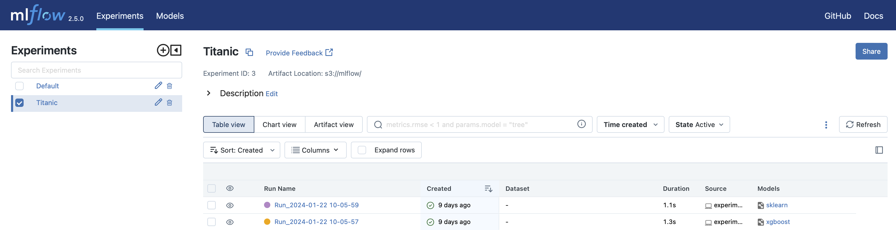
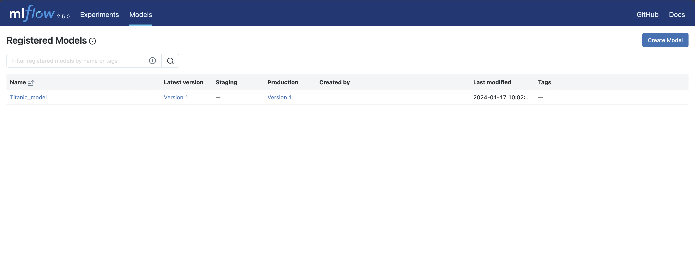

# Quick-start

# 開發實驗階段
- Quck-start 主要示範如何使用 MLflow 的服務
- 請先完成 [Quick-install](../quick_install/README.md)

## 功能介紹

- [`experiment.py`](../../projects/quick_start/dev/experiment.py) 主要是要分享如何使用我們在 Quick-install 建立的服務，開發階段主要使用 MLfow 紀錄實驗超參數、訓練結果及儲存模型，主要分為以下階段

    * 套件安裝、環境設定與宣告
    * 資料下載與前處理
    * 模型訓練與模型評估
    * 使用 MLflow 紀錄

    ### 請先開啟一個新的終端機輸入以下指令，進行環境設定與套件安裝

    ```
    conda activate mlops

    cd ~/MLOps-is-all-you-need/projects/quick_start/dev

    pip install -r requirements.txt
    ```
- [`experiment.py`](../../projects/quick_start/dev/experiment.py) 細節介紹

    ```python
    import pandas as pd
    from sklearn.preprocessing import MinMaxScaler
    from sklearn.svm import SVC
    from xgboost import XGBClassifier
    import mlflow
    from mlflow import MlflowClient
    import os
    from datetime import datetime
    import gdown
    from dotenv import load_dotenv
    ```
    
    1. 使用 load_dotenv 設定環境變數，其中分為單機版與多機板，選擇上取決於 Quick Install 安裝的版本

        * 環境變數設定檔(.env.local, .env) 放在 mlops-sys/ml_experimenter 中，在程式碼中需要指定到對應路徑，下面程式已相對路徑設定。

        ```python
            # 系統環境變數設定(單機版)
            load_dotenv("../../../mlops-sys/ml_experimenter/.env.local")

            # 系統環境變數設定(多機版)
            # load_dotenv("../../../mlops-sys/ml_experimenter/.env")
        ```

    2. 使用 gdown 獲取資料
        ```python
        # 資料下載 url
        url = "https://drive.google.com/file/d/13_yil-3-ihA_px4nFdWq8KVoQWxxffHm/view?usp=sharing"

        gdown.download(url, output='data/titanic_data.csv', quiet=False, fuzzy=True)
        ```
    3. 資料前處理
        
        ```python
        # 將 Age 的缺失值補 Age 的平均數
        data['Age'].fillna(data['Age'].mean(), inplace = True) 
        # 資料 Ground Truth 設定
        y_train = data.Survived
        X_train = data.drop(columns='Survived')
        
        # 選取數值型變項
        numerical_features = ['Age', 'SibSp', 'Parch', 'Fare']
        X_train = X_train[numerical_features]

        # 將連續變項歸一化(MinMaxScaler): 將數值壓縮到0~1之間
        scaler = MinMaxScaler()
        X_train = scaler.fit_transform(X_train)

        ```
        
    4. 模型設計
        
        ```python
        # 建立模型
        model_svc = SVC(C=1.0,        # Regularization parameter
                        kernel='rbf') # kernel
        
        model_xgb = XGBClassifier(max_depth=2,
                                  learning_rate=0.1)
        
        # 訓練模型
        model_svc.fit(X_train, y_train)
        
        model_xgb.fit(X_train, y_train)
        ```
        
    5. 評估指標
        
        ```python
        # svc 評估指標
        y_pred = model_svc.predict(X_val)
        accuracy_svc = (y_pred == y_val).sum()/y_val.shape[0]
        
        # xgb 評估指標
        y_pred = model_xgb.predict(X_val)
        accuracy_xgb = (y_pred == y_val).sum()/y_val.shape[0]
        ```
        
    6. 實驗紀錄至MLflow
        - MLflow 參數設定
            ```python
            experiment_name = 'Titanic'
            existing_exp = mlflow.get_experiment_by_name(experiment_name)
            
            if not existing_exp:
                mlflow.create_experiment(experiment_name, "s3://mlflow/")
            
            mlflow.set_experiment(experiment_name)
            ```
            
        - 實驗紀錄
            
            ```python
            # XGBoost 實驗紀錄
            now = datetime.now()
            dt_string = now.strftime("%Y-%m-%d %H-%M-%S")
            with mlflow.start_run(run_name='Run_%s' % dt_string):
                # 設定開發者名稱
                mlflow.set_experiment_tag('developer', 'GU')
                
                # 設定需要被紀錄的參數
                mlflow.log_params({
                    'Model': "XGboost",
                    'Learning rate': 0.1,
                })

                # 設定需要被紀錄的評估指標
                mlflow.log_metric("Test Accuracy", accuracy_xgb)

                # 上傳訓練好的模型
                mlflow.xgboost.log_model(model_xgb, artifact_path='Model')
            
            # SVC 實驗紀錄
            now = datetime.now()
            dt_string = now.strftime("%Y-%m-%d %H-%M-%S")
            with mlflow.start_run(run_name='Run_%s' % dt_string):
                # 設定開發者名稱
                mlflow.set_experiment_tag('developer', 'GU')
                
                # 設定需要被紀錄的參數
                mlflow.log_params({
                    'Model': 'SVC',
                    'C': 1,
                    'kernel':'rbf'
                })

                # 設定需要被紀錄的評估指標
                mlflow.log_metric("Test Accuracy", accuracy_svc)

                # 上傳訓練好的模型
                mlflow.sklearn.log_model(model_svc, artifact_path='Model')
            ```

完成[`experiment.py`](../../projects/quick_start/dev/experiment.py) 可以進入MLflow UI http://localhost:5050/ 左側 Experiments 選取 Titanc 可以看到兩個模型已被記錄。

     

# 佈署階段
- 使用 MLflow 完成一個簡易的模型部署
- 請先完成 [Quick-install](../quick_install/README.md) 與 [experiment.py](./dev/experiment.py)


## 功能介紹

- [`deployment.py`](../../projects/quick_start/dev/deployment.py)分享如何使用 MLflow  將訓練好的模型進行部署，一般來說會有兩道手續：
    1. 從眾多實驗中找出要將哪個模型進行部署，需要對該模型進行"註冊"(Register)
    2. 使用註冊後的模型進行部署，並實際進行模型推論
        - 因為部署階段需要使用到前面安裝步驟的相關套件，所以請先確保有確實完成 Quick-install
        - 此階段需要幾個訓練完成的模型並上傳至 MLflow，也請確定[`experiment.py`](../../projects/quick_start/dev/experiment.py)有確實完成
    
    ### 請先開啟一個新的終端機輸入以下指令

    ```
    conda activate mlops

    cd ~/MLOps-is-all-you-need/projects/quick_start/dev

    ```
- [`deployment.py`](../../projects/quick_start/dev/deployment.py) 詳細介紹

    ```python
     # 套件宣告、環境變數設定
    import mlflow
    from mlflow import MlflowClient
    import os
    from dotenv import load_dotenv
    ```
        
    1. 使用 load_dotenv 設定環境變數，其中分為單機版與多機板，選擇上取決於 Quick Install 安裝的版本

        ```python
            # 系統環境變數設定(單機版)
            load_dotenv("../../../mlops-sys/ml_experimenter/.env.local")

            # 系統環境變數設定(多機版)
            # load_dotenv("../../../mlops-sys/ml_experimenter/.env")
        ```

    2. 註冊模型(Register model)

        - 獲得實驗編號
            
            ```python
            target_experiments = {}
            for rm in mlflow.search_experiments(filter_string="name = 'Titanic'"):
                target_experiments = dict(rm)
            
            experiment_id = target_experiments['experiment_id']
            ```
            
        - 透過實驗編號取得每一次的模型紀錄
            
            ```python
            runs_df = mlflow.search_runs(experiment_ids=experiment_id)
            runs_df = runs_df.sort_values(by=['metrics.Test Accuracy'], ascending=False)
            runs_df.reset_index(inplace=True)
            ```
            
        - 將評估指標表現最好的模型進行”註冊“
            
            ```python
            best_run = runs_df.iloc[0]
            best_run_id = best_run["run_id"]
            mv = mlflow.register_model(model_uri="runs:/%s/Model"%best_run_id, 
                                       name="Titanic_model")
            ```
            
        - 將註冊後的模型加入版本號(Staging, Production, Archived)
            
            ```python
            client = MlflowClient(tracking_uri=os.getenv('MLFLOW_TRACKING_URI'))
            client.transition_model_version_stage(
                name="Titanic_model", version=int(mv.version), stage="Production"
            )
            ```
            
    3. 模型部署預測

        - 下載註冊後的模型, 並使用MLflow 讀取模型
            
            ```python
            model_name = "Titanic_model"
            stage = "Production"
            
            model = mlflow.pyfunc.load_model(model_uri=f"models:/{model_name}/{stage}")
            ```
            
        - 建立一筆測試資料，並進行預測
            
            ```python
            result = model.predict(X_train[:1])
            print(result)
            ```

完成[`deployment.py`](../../projects/quick_start/dev/deployment.py)可以進入MLflow UI http://localhost:5050/#/models 查看註冊的模型(Registered Model)


