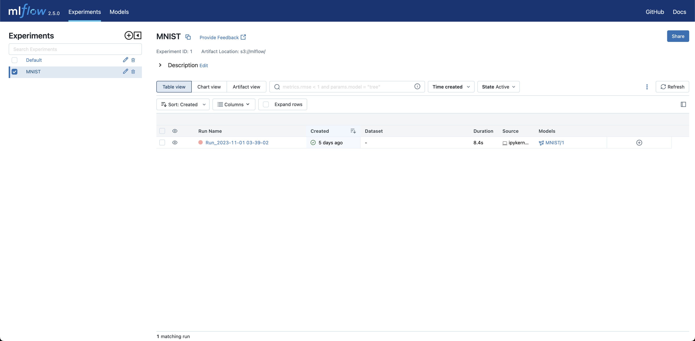
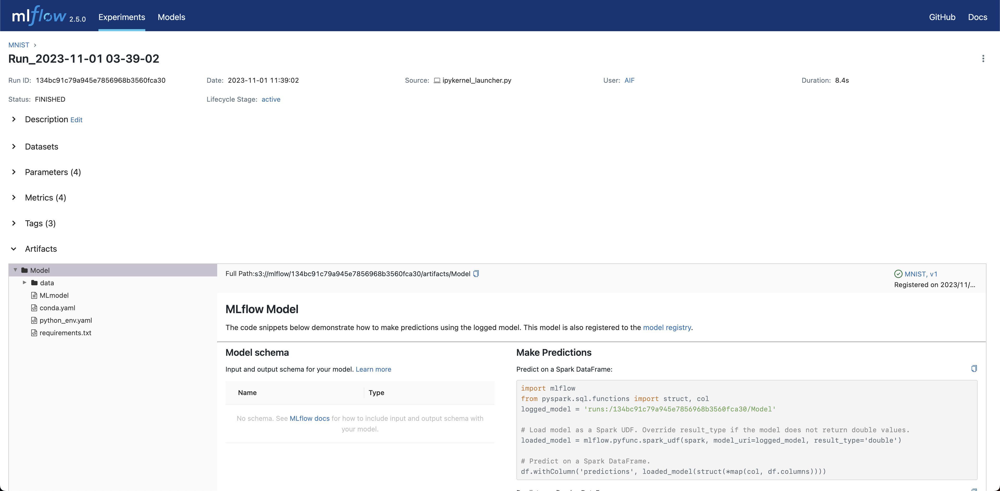
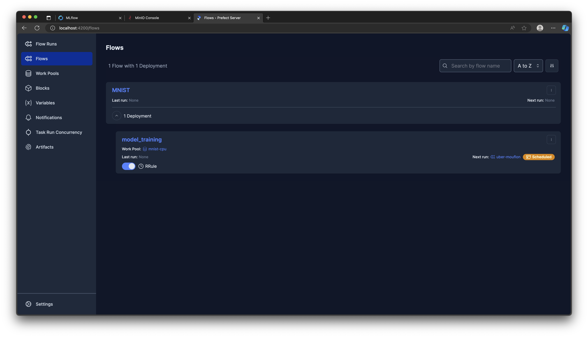
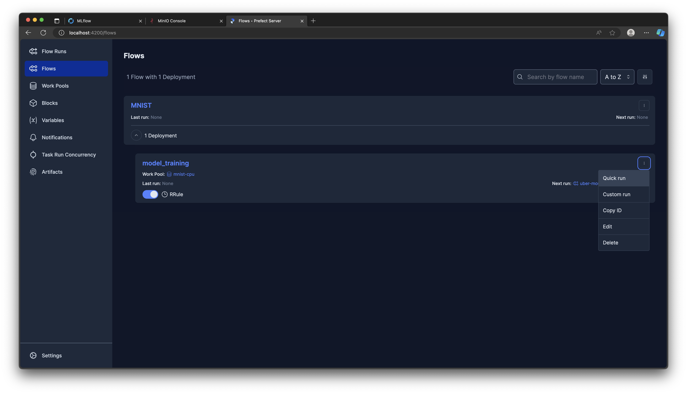
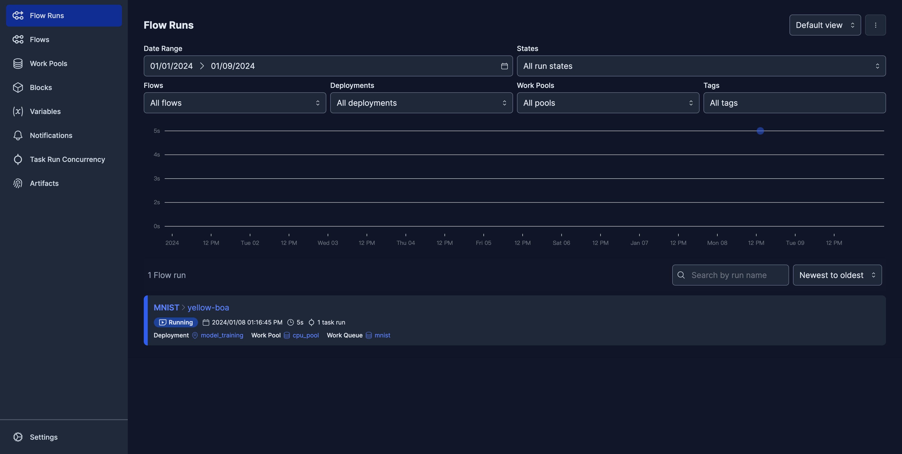
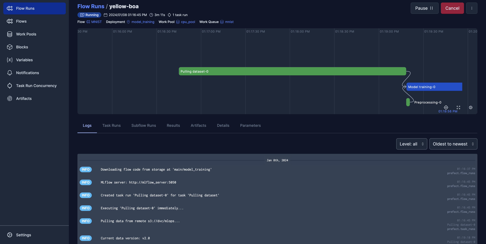

# 以手寫數字資料集實作系統建置與執行實驗
這份範例是透過手寫數字辨識模型的開發，實際操作以下步驟：
- 進行資料版本控制
- 在模型實驗階段，訓練模型並追蹤模型結果
- 模型穩定後，對模型的定期再訓練進行自動化排程

## 目錄
- [使用工具](#使用工具)
- [環境需求](#運行環境需求)
- [工作資料夾結構](#工作資料夾結構)
- [執行步驟](#執行步驟)
    - [資料版本控制](#1-資料版本控制)
    - [實驗性的訓練](#2-實驗性的訓練)
    - [模型的定期再訓練](#3-模型的定期再訓練)
    - [測試](#4-測試)

## 使用工具
* [MinIO](https://min.io)：提供[物件儲存](https://aws.amazon.com/tw/what-is/object-storage/)服務。
* [Prefect](https://www.prefect.io)：把定期執行的任務進行排程，並透過[Prefect Agent](https://docs.prefect.io/latest/concepts/agents/)執行，使用者能隨時透過其UI監控每個工作的狀態。
* [MLflow](https://mlflow.org)：MLflow能用來追蹤模型、紀錄實驗結果，以及做到模型版本控制。
* [Data Version Control (DVC)](https://dvc.org)：DVC是著名的開源資料版本控制工具，操作邏輯與[Git](https://git-scm.com)類似，可支援S3、Google Drive以及其他常見的雲端服務。

## 環境需求
需要確認以下服務正常運作：
* MinIO
* Prefect
* MLflow

## 工作資料夾結構
```
flow-mnist
├── config
│   ├── dataset.yaml
│   ├── flow.yaml
│   └── hyp.yaml
├── data
│   ├── MNIST.zip
│   └── data_version.sh
├── flow.py
├── mnist.ipynb
└── requirements.txt
```
* `config/`: 放置任務的各項設定值
  - `dataset.yaml`: 資料集相關設定，例如資料的路徑
  - `flow.yaml`: 排程相關設定
  - `hyp.yaml`: 模型超參數設定
* `data/`: 放置資料集與版本控制檔案
  - `MNIST.zip`: 資料集
  - `data_version.sh`: 進行資料版本控制
* `flow.py`: 要讓Prefect自動執行的Python檔
* `mnist.ipynb`: 執行模型訓練的Jupyter Notebook
* `requirements.txt`: 在本機端執行任務所需的套件

## 執行步驟
### 1. 資料版本控制
在`MLOps-is-all-you-need/flows/flow-mnist/data/`執行`data_version.sh`：
````shell
cd MLOps-is-all-you-need/flows/flow-mnist/data/
. ./data_version.sh
````
執行`data_version.sh`目的是為了使用DVC來對訓練資料進行版本控制，執行的動作有以下幾點，可以展開來查看較詳細的說明：
<details>
  <summary>將<code>MNIST/</code>資料夾加入追蹤，建立v1.0的資料集</summary>

````shell
set -a            
source ../.env  # 設定環境變數
set +a

unzip MNIST.zip  # 解壓縮MNIST.zip，如果已經解壓縮過，這條可以註解掉

# 製作v1.0的訓練資料，並讓DVC開始追蹤
git init  # 需要先以git對資料夾進行初始化
dvc init  # DVC對資路夾進行初始化
dvc add MNIST  # 將MNIST資料夾以DVC追蹤
git add .gitignore MNIST.dvc  # git add 後面的檔案順序可對調
git commit -m "First version of training data."  # 以git對.dvc進行版控
git tag -a "v1.0" -m "Created MNIST."  # 建立標籤，未來要重回某個版本時比較方便
````
</details>

<details>
  <summary>推送至DVC remote</summary>

````shell
export AWS_ACCESS_KEY_ID=$MINIO_ROOT_USER
export AWS_SECRET_ACCESS_KEY=$MINIO_ROOT_PASSWORD

echo "Pushing to s3://$DVC_BUCKET_NAME/$PROJECT_NAME/"
dvc remote add -f minio_s3 s3://$DVC_BUCKET_NAME/$PROJECT_NAME/  # remote為自定義的遠端名稱
dvc remote modify minio_s3 endpointurl $MLFLOW_S3_ENDPOINT_URL
dvc push -r minio_s3  # 推送至minio_s3
````

要在其他設備或容器下載資料集的話，只要取得`MNIST.dvc`，執行以下程式碼即可：
````commandline
export AWS_ACCESS_KEY_ID=[MinIO的帳號]
export AWS_SECRET_ACCESS_KEY=[MinIO的密碼]
dvc remote add remote [DVC remote路徑]
dvc remote modify remote endpointurl [MinIO endpoint URL]
dvc pull --remote remote
````
</details>

<details>
  <summary>增加一些資料，作為v2.0的資料集，同樣也推送到DVC remote</summary>

````shell
# 將更多訓練資料加入train/
for ((digit=0; digit<=9; digit++))
do
    mv ./MNIST/train_v2/$digit/* ./MNIST/train/$digit/
done
rm -r ./MNIST/train_v2/

# 製作v2.0的訓練資料
dvc add MNIST
git add MNIST.dvc
git commit -m "Add some images"
git tag -a "v2.0" -m "More images added."
dvc push -r minio_s3
#git push  # 如果有遠端的git repo才需要執行
````
</details>

### 2. 實驗性的訓練
執行`MLOps-is-all-you-need/flows/flow-mnist/mnist.ipynb`的所有步驟，完成模型訓練與追蹤。

<details>
<summary>
如何在MLflow UI檢視實驗結果
</summary>

待`mnist.ipynb`全部執行完，就可以進入MLflow UI檢視剛才紀錄的實驗結果，進入MLflow UI後，於畫面左側實驗名稱點選「MNIST」，進入到這個實驗的頁面：


進入實驗後，點選某一次的執行即可檢視結果：

> 可以展開左側「Parameters」檢視模型訓練時的超參數，或是展開「Metrics」確認模型指標。

</details>

### 3. 模型的定期再訓練
#### 3.1. 製作自動化排程
執行以下指令將排程資料上傳到Prefect伺服器：
````shell
cd MLOps-is-all-you-need/mlops-sys/flow_scheduler/
docker compose -f docker-compose-local.yml --env-file ./.env.local up --build
````

這個步驟的目的是將工作資料夾（就是`flow-mnist`）上傳到Prefect伺服器，並且製作排程。當容器成功建立，會看到包含以下文字的訊息：
````
✔ Container flow_scheduler  Created
Attaching to flow_scheduler
flow_scheduler  | Created work pool 'cpu_pool'.
flow_scheduler  | Found flow 'MNIST'
flow_scheduler  | Deployment YAML created at '/root/flows/main-deployment.yaml'.
flow_scheduler  | Successfully uploaded 53 files to s3://prefect/main/model_training
flow_scheduler  | Deployment 'MNIST/model_training' successfully created with id 
flow_scheduler  | '44bf4823-0335-4275-808d-a3659b7f1b1a'.  # 在你的環境執行時，此id可能會與範例不同
flow_scheduler  | 
flow_scheduler  | To execute flow runs from this deployment, start an agent that pulls work from 
flow_scheduler  | the 'cpu_pool' work pool:
flow_scheduler  | 
flow_scheduler  | $ prefect agent start -p 'cpu_pool'
flow_scheduler exited with code 0
````
> 訊息顯示排程已上傳至Prefect伺服器，正等待Prefect Agent來執行這個排程，接下來就要啟動另一個容器來建立Prefect Agent。

#### 3.2. 建立Prefect Agent來執行排程
啟動Prefect Agent：
````shell
cd MLOps-is-all-you-need/mlops-sys/flow_agent/cpu_pool_mnist_local_cpu/
docker compose up --build -d
````
> 在`docker compose up`後加上`-d`，就能讓Docker不佔用一個終端機視窗。

Prefect Agent會依照排程指定的時間自Prefect伺服器下載工作資料夾，並執行指定的Python檔，不過要注意的是此Python檔必須配合[Prefect規定的方式](https://docs.prefect.io/latest/tutorial/flows/)撰寫，例如：

````python
import mlflow
from prefect import flow, task

@task(name='Model training')  # 以@task裝飾，代表是流程中的一個任務
def model_training():  # 模型訓練
    ...

@flow(name='MNIST')  # 以@flow裝飾，代表是工作流程
def main():  # main
    model_training()
    ...

if __name__ == '__main__':
    main()
````

> 此範例以CPU版進行說明，若要使用GPU版，可參考[4-GPU-agent](/4-GPU-agent/)。

### 4. 測試
在排程開始執行前我們需要進行測試，來確認排程可以正常執行。

進入Prefect UI，在左側欄選擇「Flows」，確認畫面中是否出現「MNIST」


展開「MNIST」，到「model_training」卡片的右上角點選選項（ ⋮ ）按鈕，點一下「Quick run」來快速執行一次排程，畫面右下角會立即顯示這個任務的名稱（Prefect會為每次任務隨機指派一個特定名稱）。


接著在左側欄位點選「Flow Runs」，點選任務名稱


就可以監控任務執行的狀態

